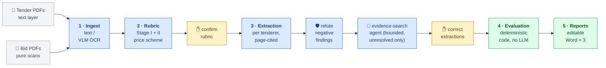

# Tender Evaluation Assistant

Demo of an AI-assisted **procurement review pipeline** for public tender evaluation.
Input: a tender document set + one bid (offer) per tenderer. Output: an editable Word
**procurement review report** — Price Summary table, Stage I / Stage II conclusions, and a
detailed evaluation record sheet.

> **CONFIDENTIALITY WARNING**
> The models are whatever `.env` points at: the measured demo configurations use
> **cloud APIs** (DeepSeek, Gemini on Vertex AI) or local Ollama. **Never** feed real
> client tender/bid documents through any cloud path. Use the bundled synthetic
> fixtures, or your own sanitized samples. The production design targets fully local
> inference (Qwen3-VL / Qwen3.6 / DeepSeek on DGX Spark via vLLM) — the LLM client is
> OpenAI-compatible, so production points the base URL at vLLM with no code change.

## Pipeline (mirrors the TAP workflow)



🔵 LLM reads &nbsp;·&nbsp; 🟢 deterministic code computes &nbsp;·&nbsp; 🟡 human decides —
rubric derives Stage I checklist, Stage II essential requirements and the price formula
from *this* tender's documents; extraction cites file + page for every fact; evaluation
covers both stage matrices plus rounding, FX, arithmetic tally and ranking. The whole
flow runs as a **LangGraph state graph** (`app/graph.py`): durable per-project
checkpoints, the two human checkpoints as `interrupt()`s, bids fanned out in parallel.
The agent step is the only place an LLM chooses its own actions — and it is bounded:
read-only tools, step and OCR budgets, quotes verified on the cited page.

Design principles:

- **LLMs extract and classify; code calculates and ranks.** All arithmetic (totals,
  cost-effectiveness `D × M`, 2-significant-figure rounding, rankings, FX conversion,
  quoted-total tally check) is deterministic Python.
- **Every tender is different** → the rubric is *derived from the tender documents* per
  project, and is saved as editable JSON (`rubric.json`) for human confirmation before
  evaluation.
- **Evidence-first**: extracted facts carry page references; the evaluation record sheet
  shows them so the Tender Assessment Panel can verify every cell.
- **Citations are grounded in code** (`app/grounding.py`): a finding that cites a page
  nobody read is demoted (present → missing, yes/no → unclear); verification
  refutations and agent results must quote text that appears on the cited page.
- **Bounded agency** (`app/agent.py`): the top-level flow is a fixed workflow. The one
  agentic step — evidence search for findings still missing/unclear after
  verification — picks its own tool calls (list/search/read pages, OCR a page on
  demand) under step and OCR budgets, can only *add* verified evidence, and never
  changes a compliance verdict.

## Quickstart

```bash
cd tender_evaluation_assistant
python3 -m venv .venv && .venv/bin/pip install -r requirements.txt

# 1) Offline demo — no network, runs the synthetic case end-to-end:
.venv/bin/python run_demo.py offline-demo
# → output/offline_demo/reports/{price_summary,summary_list,evaluation_record}.docx

# 2) Run tests:
.venv/bin/python -m pytest test/ -q

# 3) Live demo with local Ollama (default backend — no key, no cloud):
#    Install https://ollama.com then:
#      ollama pull qwen3:8b && ollama pull qwen3-vl:8b
# demo_case/ is committed; regenerate it (same content) with: tools/make_demo_case.py
# --bids-dir holds one subfolder (or one PDF) per tenderer; --acknowledge-cloud is the
# confidentiality gate — it only matters when .env points at a cloud endpoint.
GITHUB_MODELS_BASE_URL=http://localhost:11434/v1 .venv/bin/python run_demo.py run \
    --tender-dir demo_case/tender --bids-dir demo_case/bids \
    --out output/live_demo --acknowledge-cloud

# 4) Evidence-search benchmark — the agent OFF vs ON, scored against ground truth:
.venv/bin/python tools/make_demo_case.py --buried --bidders 3 --out buried_case
GITHUB_MODELS_BASE_URL=http://localhost:11434/v1 .venv/bin/python tools/benchmark_buried.py \
    --case buried_case --max-ocr-pages 4
```

The synthetic live case is designed to exercise the interesting paths: Tenderer C is
cheapest but omits the Non-collusive Tendering Certificate (fails Stage I), and
Tenderer B's quoted total contains a deliberate arithmetic error that the price engine
flags — while B is still (correctly) the recommended conforming offer. Checkpoint files
under `output/live_demo/` (`rubric.json`, `bids/*.json`) are editable; delete one to
re-derive/re-extract it on the next run.

**LLM backend**: any OpenAI-compatible endpoint, configured entirely in `.env`. Two
ready-made setups: fully **local Ollama** (free, keyless —
`ollama pull qwen3:8b && ollama pull qwen3-vl:8b`), or a cheap **cloud text primary**
such as DeepSeek (`TEXT_MODEL=deepseek-chat@https://api.deepseek.com/v1` +
`DEEPSEEK_API_KEY`) with local Ollama as automatic fallback — synthetic/sanitized
documents only on any cloud path. Hosted endpoints pick their key by hostname
(`DEEPSEEK_API_KEY`, `GEMINI_API_KEY`, `DASHSCOPE_API_KEY`, `ZHIPU_API_KEY`,
), so a fallback chain can span providers. Chains
(`*_MODEL_FALLBACKS`) are tried automatically when the model before them fails.
Production swaps the base URL for vLLM on the client's hardware. (The original demo
backend, GitHub Models, was retired in 2026.)

## Development workflow

Two people share this repo, so every change reaches `main` through a pull request reviewed by the other person (ownership and open decisions: `docs/merge_plan_checklist.md`).

```bash
pip install -r requirements-dev.txt     # ruff, pre-commit, pip-audit on top of requirements.txt
git config core.hooksPath .githooks     # runs the pre-commit hooks on commit; refuses direct pushes to main
pre-commit run --all-files              # exactly what CI's lint job runs
# after changing requirements*.txt:
uv pip compile requirements.txt --python-version 3.12 --generate-hashes -o requirements.lock
```

CI on every pull request: `lint` (pre-commit: ruff, gitleaks, large files, merge markers, PDF placement), `test` (the offline suite, installed from `requirements.lock`), `security` (gitleaks over the full history, pip-audit over the lockfile). On `main`, `main-guard` fails when a commit did not arrive through a merged pull request. Opt-in test levels are the pytest markers `orchestrator`, `realdata` and `live`; the default run excludes them and needs no network, tokens or client data.

## Repository layout

```
app/                the pipeline library (shared by CLI and backend)
  config.py         env + model configuration (the cloud ⇄ local vLLM swap point)
  llm.py            OpenAI-compatible client: fallback chains, JSON-validated chat, OCR
  ingest.py         PDF classification (text vs scan), text extraction, VLM OCR + cache
  schemas.py        pydantic models: Rubric, BidExtraction, EvaluationResult…
  rubric.py         tender understanding → evaluation rubric (Stage I/II + price scheme)
  bid_extract.py    per-bid field extraction with page citations
  evaluate.py       Stage I / Stage II matrices + English conclusions (deterministic)
  pricing.py        deterministic price engine (both Price Summary formats)
  report.py         Word report generation (python-docx)
  grounding.py      citation grounding: unread-page citations are not evidence
  tools.py          the agent's read-only tools, incl. on-demand OCR with a budget
  agent.py          bounded evidence-search agent: structured actions, budgets, trace
  gcp.py            Vertex AI auth: OAuth token provider over Application Default Credentials
  usage.py          per-bid token / call / $ accounting, price table, run summaries
  graph.py          LangGraph orchestration: state, checkpoints, interrupts, Send fan-out
  pipeline.py       bidder discovery, offline (fixture) run, console summary
backend/            FastAPI service (projects, uploads, jobs, reports API) + Dockerfile
frontend/           Streamlit review UI (HTTP client of the backend only) + Dockerfile
mcp_server/         MCP server over the read-only tools + local-model MCP client
docs/               plan (dated experiment log), detailed specification, interview prep, project report (audit)
docker-compose.yml  runs both services together
deploy/cloudrun/    private Cloud Run packaging: nginx ingress sidecar, Cloud Build, setup/deploy scripts
run_demo.py         CLI (offline demo + orchestrated run over real folders)
test/               105 offline tests incl. API, graph, agent, MCP, cost ledger, Cloud Run scratch sync (no network, no client data)
tools/              case generator (incl. --buried benchmark case, ground truth), PDF
                    generator, stress driver, evidence-search benchmark, case scorer,
                    OCR comparison, results tables
```

## Service mode — frontend + backend

Requirements are split per service: `backend/requirements.txt` (FastAPI + pipeline) and
`frontend/requirements.txt` (Streamlit + requests only). Root `requirements.txt` is the
dev aggregate (both + pytest).

```bash
# Local dev, two terminals:
.venv/bin/uvicorn backend.api:app --reload --port 8000
BACKEND_URL=http://localhost:8000 .venv/bin/streamlit run frontend/ui.py

# Docker (recommended):
cp .env.example .env       # point the models at Ollama/DeepSeek/Vertex; set API_KEY on any shared machine
docker compose up -d --build
# UI:  http://localhost:8501     API: http://localhost:8000/health
```

UI flow = **one orchestrated run with two human checkpoints** (`POST /run`,
`POST /resume`): upload documents → *Run* derives the rubric and pauses → review it
(every item shows its source citation — file, page, quoted clause — next to a
rendered tender-page preview; edit the JSON if needed) → *Confirm & continue*
extracts all bids in parallel, verifies them and runs the evidence-search agent on
whatever is still unresolved, then pauses → triaged review (negative findings first
with 🔴/🟠 badges, passed checks collapsed, 🔎 marks evidence the agent found, its
step trace in an expander, jump-to-cited-page preview) → *Confirm & continue*
evaluates and renders the Word reports. Edits made while paused are picked up on
resume; corrected bids are never re-extracted. Layers that run automatically:

- **Targeted retrieval** (`app/retrieval.py`): pages are keyword-scored and only the
  relevant ones enter the prompt — a Price Schedule on page 40 of a 300-page bid is
  found, not truncated away.
- **Adversarial verification** (`app/verify.py`): every negative finding (document
  missing / non-compliant) gets an independent refutation attempt before it can reach
  a report; refuted "missing" is restored with evidence, refuted "non-compliant" is
  demoted to *unclear* for human clarification — never auto-passed. Disable with
  `VERIFY_FINDINGS=0`.
- **Per-page OCR routing** (`app/ingest.py`): the text-vs-scan decision is per page,
  so a digital document with a scanned annex OCRs only the annex, and a scan with an
  embedded text layer on some pages skips OCR there.
- **Parallel extraction** (`app/graph.py`): bids without a stored extraction fan out
  as parallel graph branches (`MAX_PARALLEL_BIDS`, default 4) — cloud endpoints scale
  with it; a local Ollama simply queues the requests. 30 bidders: 82.6–115 s end to end
  on the cloud text models (measured table below; 116 s on the 2026-09-03 run).
- **Citation grounding** (`app/grounding.py`): "present on page 11" is not accepted if
  page 11 was never read — the finding is demoted so verification and the agent
  actually look. Refutations and agent results must quote text on the cited page.
- **Evidence-search agent** (`app/agent.py`, `app/tools.py`): for findings still
  missing/unclear after verification, and for a price the first pass never saw, a
  bounded tool-using loop reads the contents page, OCRs the pages it points to (on
  demand, within `AGENT_OCR_PAGES`), and finishes only with a quote verified on that
  page. `AGENT_SEARCH=0` disables it. First measured on the `--buried` case (schedules
  on pages 9–12 of scan-only offers, first pass capped at 4 pages; 2026-09-03 run,
  DeepSeek text + local OCR — the per-provider reruns are in the table further down):

  | run | certificate recall | false restores | price extracted | unclear findings w/ evidence |
  | --- | --- | --- | --- | --- |
  | agent off | 0/2 | 0 | 0/3 | 0/9 |
  | agent on | **2/2** | **0** | **3/3** | **8/9** |

Project data lives in `./data/` on the host (bind-mounted volume). CI runs the full
offline test suite on every push (`.github/workflows/ci.yml`). The same read-only
tools are exposed as an MCP server — see the next section.

## MCP server — the tools as a product surface

The read-only tools the evidence-search agent uses are also exposed over the
[Model Context Protocol](https://modelcontextprotocol.io) (`mcp_server/server.py`,
official `mcp` SDK 2.2), so any MCP client can walk a tender or an offer and answer a
reviewer's question with page citations: `list_projects` → `list_bids` →
`select_bid` / `select_tender` → `list_pages`, `search_pages`, `read_page`,
`ocr_page` (on-demand OCR of scanned pages, `AGENT_OCR_PAGES` budget, cache shared
with the pipeline), plus `get_rubric`. The server never writes anything but that
cache.

> **Confidentiality rule.** An MCP server only moves *tool execution* onto the
> machine holding the documents — every tool result (page listings, snippets, page
> text, OCR output) goes to whatever model drives the connected client. Claude
> Desktop, Cursor and similar clients are driven by cloud models, so connecting them
> is cloud egress of document content: **synthetic or sanitized projects only**.
> This is enforced in code, not left to the operator: a project is served only if it
> was created with the *synthetic* flag (checkbox in the UI, `"synthetic": true` in
> `meta.json`); unflagged projects are not even listed. The exception is an
> on-premises client, declared by starting the server with `MCP_LOCAL_MODEL=1` — the
> bundled local client does that itself. The HTTP transport is off unless
> `ALLOW_CLOUD_CLIENTS=1`, binds to loopback, requires `X-API-Key` and serves
> synthetic projects only, whatever `MCP_LOCAL_MODEL` says.

**Production-compatible client** — the project's own `LLM` class on a *local* model
drives the same tools over stdio, so nothing leaves the machine (Ollama on a laptop,
vLLM on the DGX Spark); cloud endpoints are refused unless `--allow-cloud-model`:

```bash
python -m mcp_server.local_client \
  "Does the offer include the Non-collusive Tendering Certificate?" \
  --project <project-id> --tenderer Tenderer_03 --trace trace.json
# --model qwen3:8b@http://localhost:11434/v1 is the default (LOCAL_TEXT_MODEL)
# native runs: GITHUB_MODELS_BASE_URL=http://localhost:11434/v1 (not host.docker.internal)
```

It keeps the agent's guardrails: schema-validated JSON actions, a step budget, the
server's OCR budget, and a quote-on-page check — `found=true` is accepted only if the
quoted text is on a page the client actually read, so the failure mode is "not
found", never a fabricated citation.

**Claude Desktop (demo, synthetic projects only)** — `claude_desktop_config.json`:

```json
{
  "mcpServers": {
    "tender-assistant": {
      "command": "/abs/path/tender_evaluation_assistant/.venv/bin/python",
      "args": ["/abs/path/tender_evaluation_assistant/mcp_server/server.py"]
    }
  }
}
```

`python -m mcp_server.server --list` prints what a given policy would serve. Measured
on the synthetic `--buried` case (12-page scan-only offers, first pass cached pages
1–4 only, agent off), same question, same tools, two drivers:

| driver (model reading the tool results) | tenderer | truth | outcome | steps | OCR calls | seconds | path |
| --- | --- | --- | --- | --- | --- | --- | --- |
| cloud — DeepSeek via `--allow-cloud-model` | Tenderer_01 | cert on p.11 | **found p.11**, quote verified | 3 | 1 | 32 | contents → `read_page(11)` (hint) → `ocr_page(11)` → finish |
| cloud — DeepSeek | Tenderer_03 | no cert | **not found** (correct) | 7 | 3 | 127 | contents → `ocr_page(11)`, `(12)`, `(5)` → search → finish(found=false) |
| local — `qwen3:8b`, cold cache | Tenderer_02 | cert on p.11 | **found p.11**, quote verified | 4 | 1 | 111 | contents → `ocr_page(11)` → finish rejected (no `page`) → finish(page=11) |
| local — `qwen3:8b`, warm cache | Tenderer_03 | no cert | **not found** (correct) | 3 | 0 | 158 | contents → `ocr_page(11)` (cached) → `read_page(12)` → finish(found=false) |
| local — `qwen3:8b`, warm cache, *before* the clearer rejection message | Tenderer_01 | cert on p.11 | budget exhausted — **no answer, no fabricated citation** | 10 | 0 | 243 | read p.11 four times, six `finish` attempts without `page`, all rejected |

Both drivers follow the same contents-page → page 11 path the pipeline's agent
takes. The 8B local model is slower and clumsier (it forgot the `page` field until
the rejection message named it), but the guardrails hold: every "found" carries a
quote verified on the cited page, and every failure is "not found" or "budget
exhausted", never an invented citation. Traces: `docs/mcp_traces/`. The cloud
driver here plays the role of Claude Desktop — structurally the same egress — on
a project created with the *synthetic* flag; unflagged projects are refused (tested
live over HTTP: no key → 401, unflagged → refused, synthetic → served).

## Measured across providers — Gemini on Vertex AI, DeepSeek, fully local

"Provider-agnostic" is a claim until it is measured. The model layer takes any
OpenAI-compatible endpoint per chain entry (`model@base_url`), and step 2 of the plan
added the two things a real comparison needs:

- **Vertex AI auth.** Google's OpenAI-compatible endpoint takes no API key: requests
  carry a short-lived OAuth token from Application Default Credentials
  (`gcloud auth application-default login`). `app/gcp.py` refreshes it ahead of
  expiry under a lock, because the parallel fan-out calls the model from several
  threads; `key_for()` never hands the AI Studio key to a Vertex host.
- **Cost accounting.** Every call is recorded per bid and per served model — prompt,
  cached and billable output tokens (Gemini's thinking tokens are billed as output,
  DeepSeek's cache hits are cheaper), seconds, dollars from a price table verified
  on the day (`app/usage.py`, overridable with `MODEL_PRICES`). The graph writes
  `work/usage/<bid>.json` and a `summary.json`; `GET /projects/{id}/usage` and the
  evaluation page show **$ per bid**; failed calls (fallbacks) are counted so a
  provider that silently shifted work to the local model cannot skew a number.

Same synthetic cases, same code, three configurations (`tools/stress_test.py --out`,
`tools/benchmark_buried.py`, `tools/ocr_compare.py`, tables by
`tools/compare_runs.py`; prices of 2026-09-09, standard tier):

<!-- STEP2_TABLES_START -->
**30-bidder stress case** (two scan-only bids; agreement = 116 checks against the seeded
ground truth: Stage I and II verdicts, arithmetic flags, unit prices):

| configuration | agreement | wall clock | rubric | extraction | $ total | $ / bid (mean · median) | tokens / bid | model s / bid (median) | failed calls |
| --- | --- | --- | --- | --- | --- | --- | --- | --- | --- |
| Gemini 2.5 Flash on Vertex AI (text + OCR) | 116/116 (100.0%) | 82.6 s | 8.0 s | 72.4 s | $0.1621 | $0.0053 · $0.0047 | 4788 | 6.8 s | 0 |
| DeepSeek-V4-Flash + local qwen3-vl OCR | 116/116 (100.0%) | 115.2 s | 4.0 s | 109.0 s | $0.0303 | $0.001 · $0.0008 | 3294 | 2.9 s | 0 |
| fully local qwen3:8b + qwen3-vl:8b (laptop) | 116/116 (100.0%) | 2731.4 s | 98.4 s | 2631 s | $0.0 | $0.0 · $0.0 | 4145 | 131.3 s | 0 |
| Gemini on Vertex AI, **deployed on Cloud Run** (driven from the laptop through the IAM proxy, 2026-09-10) | 116/116 (100.0%) | 100.9 s (12.8 s of it upload) | 11.0 s | 76.0 s | $0.1621 | $0.0053 · $0.0047 | 4788 | 6.4 s | 0 |

**Buried-evidence benchmark** (12-page scan-only offers, schedules on pages 9–12, first
pass capped at 4 pages):

| configuration | run | certificate recall | false restores | price extracted | unclear w/ evidence | agent OCR pages | time | $ |
| --- | --- | --- | --- | --- | --- | --- | --- | --- |
| Vertex Gemini | baseline | 0/2 | 0 | 0/3 | 0/9 | 0 | 30 s | $0.0323 |
| Vertex Gemini | agent | 2/2 | 0 | 3/3 | 9/9 | 15 | 228 s | $0.1209 |
| DeepSeek + local OCR | baseline | 0/2 | 0 | 0/3 | 0/9 | 0 | 585 s | $0.0038 |
| DeepSeek + local OCR | agent | 2/2 | 0 | 3/3 | 6/9 | 16 | 856 s | $0.0162 |
| fully local | baseline | 0/2 | 0 | 0/3 | 0/9 | 0 | 1106 s | $0.0 |
| fully local | agent (bids 1–2 of 3; 3rd ran away) | 0/2 | 0 | 1/2 | 0/6 | 10 | 3818 s | $0 |

*Fully local agent run: the 3-way-parallel attempt aborted on a 600 s timeout; run sequentially, the 8B model drove the tools for 27 and 37 minutes on bids 1–2 without finding either certificate (both exist on page 11) and restored one price; the third bid — the one with no certificate, where the search must exhaust its budget — ran away twice (14k generated tokens per request, with a 4k and then a 16k context) and was stopped. 0 false restores, no fabricated citation: the guardrails held, the search did not.*

**OCR, page by page** (the benchmark's 36 scanned pages, separate caches):

| chain | served | s / page | $ / page | ground-truth facts found | failed calls |
| --- | --- | --- | --- | --- | --- |
| A `qwen3-vl:8b` | qwen3-vl:8b | 48.7 | $0.0 | 14/14 | 0 |
| B `google/gemini-2.5-flash` | google/gemini-2.5-flash | 3.8 | $0.00105 | 14/14 | 0 |

Transcript similarity A vs B over 36 pages: mean 0.952, median 1.0, min 0.0. Missed by A: none. Missed by B: none. Empty transcripts — A: ['Tenderer_01 p.6']; B: none.

What the numbers say. All three configurations reach the **same verdicts** on both
cases — the deterministic layers decide, the model only extracts. Cloud models finish
30 bidders in under two minutes for **cents per tender** (Gemini ≈ $0.005 per bid,
DeepSeek ≈ $0.001, the rubric included); the fully local 8B stack reaches the same
100% for $0 but took **45 minutes in two passes** on the laptop: with four bids in
parallel a local OCR page exceeded the 10-minute client timeout at bid 29/30, and the
run was resumed from its checkpoints sequentially (`MAX_PARALLEL_BIDS=1`,
`LLM_TIMEOUT_S`) — the checkpointing did exactly what it is for. The local 8B model
also needed one more deterministic guard: it cited a contents entry as evidence for
three checklist items, which grounding now demotes in code — and it cannot drive the
evidence-search agent on this laptop (see the benchmark note; `LLM_MAX_TOKENS` now
bounds a runaway generation, and Ollama's default 4k context, which silently
truncated the agent's transcripts, needs a 16k model variant). Local OCR recovered every
ground-truth fact Gemini did, blanked one filler page, and is 13× slower per page.
These laptop numbers bound the *demo*; production inference on the client's DGX is a
different class of hardware. Metered spend for the whole step: **$0.35** (Vertex) +
**$0.05** (DeepSeek).
<!-- STEP2_TABLES_END -->

## Deployed on Google Cloud Run — private, scale-to-zero

The service stack also runs as **one private Cloud Run service** (`deploy/cloudrun/`),
measured on the same 30-bidder case: **116/116 agreement, 100.9 s end to end
including a 12.8 s upload through the proxy, $0.16 of model time** — the laptop→Vertex
run's numbers, plus network. What it is:

- **One service, three containers.** An nginx ingress sidecar (`/api/*` → FastAPI on
  :8000, everything else → Streamlit on :8501, websocket upgrade passed through) so
  the UI's browser-direct folder uploads and evidence links (`PUBLIC_BACKEND_URL=/api`,
  a relative path) hit the *same origin* — no CORS, no second public URL, and the
  API is never reachable except through the gate below. `max-instances=1`,
  CPU always allocated (the graph runs in a background thread between the UI's polls),
  request timeout 60 min for the websocket, `min-instances=0`.
- **Private by IAM.** `--no-allow-unauthenticated`; the owner is the only
  `run.invoker`. Open it with the Cloud Run proxy, which attaches your identity:
  `gcloud run services proxy tender-demo --region us-central1 --port 8080` →
  http://localhost:8080. Anonymous requests get 403 before reaching the containers;
  the API additionally requires `X-API-Key` (Secret Manager → env, never in an image).
  Identity-Aware Proxy would give a browser-openable URL with Google login, but on a
  personal project without an organisation IAP needs an OAuth consent screen and
  client created by hand in the console (tried: IAP answered *"Empty Google Account
  OAuth client ID(s)"*, reverted). Sharing later = that console step, or a public URL
  with the key.
- **Storage: a GCS bucket FUSE-mounted at `/data`** (projects, uploads, OCR cache,
  reports, the seeded inbox with both synthetic cases). Two FUSE traps handled in
  code: SQLite needs POSIX locks the mount does not have, so the LangGraph checkpoint
  DB is *worked on* under `GRAPH_DB_SCRATCH_DIR` (instance-local) and copied to the
  bucket after every job — an instance restart between the two human checkpoints
  loses nothing (tested by wiping the scratch dir mid-run); and python-docx's zip
  writer seeks backwards, which the mount logs as out-of-order writes and recovers
  slowly, so reports are now written in one sequential write.
- **Models: Gemini 2.5 Flash on Vertex AI** with the service account's own
  credentials — no provider key exists anywhere in the cloud. Roles are minimal
  (Vertex AI user, object admin on that bucket only, accessor on that secret only).
- **Builds on Cloud Build** (`cloudbuild.yaml`, three `linux/amd64` images in
  parallel, ~2 min) — no cross-architecture build on the arm64 laptop; `.gcloudignore`
  keeps data, keys, docs and tests out of the upload (35 files, 178 KiB).
- **Cost.** Nothing while idle (scale to zero; the bucket holds ~1.4 MB). While an
  instance is up (3 vCPU, 3.25 GiB, instance-based billing at Tier-1 list prices,
  $0.000018 per vCPU-second and $0.000002 per GiB-second, read from the Billing Catalog API on 2026-09-10) ≈ **$0.22 per hour**, i.e. a demo session plus its 15-minute idle
  tail ≈ $0.30, plus $0.16 of Gemini per 30-bidder run. Cloud Build's and Artifact
  Registry's free tiers cover the rest.

```bash
bash deploy/cloudrun/setup.sh    # once: APIs, registry, bucket, service account, secret, inbox
bash deploy/cloudrun/deploy.sh   # build (Cloud Build) + deploy; --no-build redeploys the last images
gcloud run services proxy tender-demo --region us-central1 --port 8080   # open http://localhost:8080
API_KEY=$(gcloud secrets versions access latest --secret=tender-api-key) \
  python tools/stress_test.py --backend http://localhost:8080/api --out output/step3/stress_cloudrun.json
```

Confidentiality is unchanged: the deployed instance only ever holds **synthetic**
projects (the bucket is single-region, private, no public access), and production
stays on the client's DGX — this deployment exists to prove the stack is portable
and to give a reviewer something to click, not to process real documents.

## Client-site (production) deployment

The product is NDA-bound to **local** deployment — real tender/bid documents never
leave the client's network. The same compose stack is the deliverable for the client's
DGX Spark: stand up vLLM serving the local models, point `GITHUB_MODELS_BASE_URL` at
it in `.env`, and build the images for ARM (`docker compose build` on the GB10, or
`--platform linux/arm64`). Set a strong `API_KEY` whenever the services are reachable
by anyone but you, and keep port 8000 (API) firewalled — the UI on 8501 is the only
thing users need.

## Demo ⇄ production mapping

| Demo (this repo)                      | Production (client site)                          |
| ------------------------------------- | ------------------------------------------------- |
| DeepSeek API `deepseek-chat` (text), or Gemini 2.5 Flash on Vertex AI | Qwen3.6-35B-A3B / DeepSeek-V4-Flash via vLLM |
| Ollama `qwen3-vl:8b` vision OCR, or Gemini 2.5 Flash on Vertex AI | Qwen3-VL-30B-A3B (MoE) page OCR, batched |
| Docker on a laptop (x86/arm)          | Same compose stack on DGX Spark GB10 (arm64)      |
| Synthetic fixtures                    | Real tender/bid sets, fully local                 |

Known demo limitations: the first-pass OCR cap per document (`MAX_OCR_PAGES` /
`--max-ocr-pages`, default 8 — the evidence-search agent reads further pages on demand
within `AGENT_OCR_PAGES`), local OCR speed (measured 48.7 s per page on `qwen3-vl:8b`
on the laptop; 3.8 s on Gemini), and no Stage III–V yet (technical marking / combined score —
phase 2).
