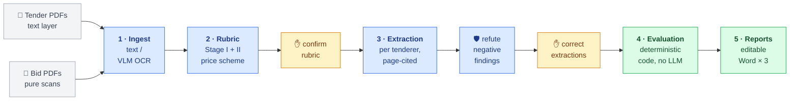

# Tender Evaluation Assistant — Demo Pipeline

Demo of an AI-assisted **procurement review pipeline** for public tender evaluation.
Input: a tender document set + one bid (offer) per tenderer. Output: an editable Word
**procurement review report** — Price Summary table, Stage I / Stage II conclusions, and a
detailed evaluation record sheet.

> **CONFIDENTIALITY WARNING**
> The demo's default text model is a **cloud API** (DeepSeek) for document understanding.
> **Never** feed real client tender/bid documents through any cloud path. Use the bundled
> synthetic fixtures, or your own sanitized samples. The production design targets fully
> local inference (Qwen3-VL / Qwen3.6 / DeepSeek on DGX Spark via vLLM) — the LLM client
> here is OpenAI-compatible, so production swaps `GITHUB_MODELS_BASE_URL` for a local
> vLLM endpoint with no code change.

## Pipeline (mirrors the TAP workflow)



🔵 LLM reads &nbsp;·&nbsp; 🟢 deterministic code computes &nbsp;·&nbsp; 🟡 human decides —
rubric derives Stage I checklist, Stage II essential requirements and the price formula
from *this* tender's documents; extraction cites file + page for every fact; evaluation
covers both stage matrices plus rounding, FX, arithmetic tally and ranking.

Design principles:

- **LLMs extract and classify; code calculates and ranks.** All arithmetic (totals,
  cost-effectiveness `D × M`, 2-significant-figure rounding, rankings, FX conversion,
  quoted-total tally check) is deterministic Python.
- **Every tender is different** → the rubric is *derived from the tender documents* per
  project, and is saved as editable JSON (`rubric.json`) for human confirmation before
  evaluation.
- **Evidence-first**: extracted facts carry page references; the evaluation record sheet
  shows them so the Tender Assessment Panel can verify every cell.

## Quickstart

```bash
cd tender_evaluation_assistant
python3 -m venv .venv && .venv/bin/pip install -r requirements.txt

# 1) Offline demo — no network, runs the synthetic case end-to-end:
.venv/bin/python run_demo.py offline-demo
# → output/offline_demo/reports/{price_summary,summary_list,evaluation_record}.docx

# 2) Run tests:
.venv/bin/python -m pytest test/ -q

# 3) Live demo with local Ollama (default backend — no key, no cloud):
#    Install https://ollama.com then:
#      ollama pull qwen3:8b && ollama pull qwen3-vl:8b
.venv/bin/python tools/make_demo_case.py     # generates synthetic demo_case/
GITHUB_MODELS_BASE_URL=http://localhost:11434/v1 .venv/bin/python run_demo.py run \
    --tender-dir demo_case/tender \
    --bids-dir demo_case/bids \      # one subfolder (or one PDF) per tenderer
    --out output/live_demo \
    --acknowledge-cloud              # only actually cloud if you point at a cloud URL
```

The synthetic live case is designed to exercise the interesting paths: Tenderer C is
cheapest but omits the Non-collusive Tendering Certificate (fails Stage I), and
Tenderer B's quoted total contains a deliberate arithmetic error that the price engine
flags — while B is still (correctly) the recommended conforming offer. Checkpoint files
under `output/live_demo/` (`rubric.json`, `bids/*.json`) are editable; delete one to
re-derive/re-extract it on the next run.

**LLM backend**: any OpenAI-compatible endpoint, configured entirely in `.env`. Two
ready-made setups: fully **local Ollama** (free, keyless —
`ollama pull qwen3:8b && ollama pull qwen3-vl:8b`), or a cheap **cloud text primary**
such as DeepSeek (`TEXT_MODEL=deepseek-chat@https://api.deepseek.com/v1` +
`DEEPSEEK_API_KEY`) with local Ollama as automatic fallback — synthetic/sanitized
documents only on any cloud path. Hosted endpoints pick their key by hostname
(`DEEPSEEK_API_KEY`, `GEMINI_API_KEY`, `DASHSCOPE_API_KEY`, `ZHIPU_API_KEY`,
`GITHUB_TOKEN`), so a fallback chain can span providers. Chains
(`*_MODEL_FALLBACKS`) are tried automatically when the model before them fails.
Production swaps the base URL for vLLM on the client's hardware. (The original demo
backend, GitHub Models, was retired in 2026.)

## Repository layout

```
app/                the pipeline library (shared by CLI and backend)
  config.py         env + model configuration (GitHub Models ⇄ local vLLM swap point)
  llm.py            OpenAI-compatible client: fallback chains, JSON-validated chat, OCR
  ingest.py         PDF classification (text vs scan), text extraction, VLM OCR + cache
  schemas.py        pydantic models: Rubric, BidExtraction, EvaluationResult…
  rubric.py         tender understanding → evaluation rubric (Stage I/II + price scheme)
  bid_extract.py    per-bid field extraction with page citations
  evaluate.py       Stage I / Stage II matrices + English conclusions (deterministic)
  pricing.py        deterministic price engine (both Price Summary formats)
  report.py         Word report generation (python-docx)
  pipeline.py       CLI orchestrator; writes rubric.json, bids/*.json, reports/
backend/            FastAPI service (projects, uploads, jobs, reports API) + Dockerfile
frontend/           Streamlit review UI (HTTP client of the backend only) + Dockerfile
docker-compose.yml  runs both services together
run_demo.py         CLI (offline demo + cloud demo)
test/               pytest suite incl. offline API tests (no network, no real client data)
tools/              synthetic demo-case generator, PDF generator
```

## Service mode — frontend + backend

Requirements are split per service: `backend/requirements.txt` (FastAPI + pipeline) and
`frontend/requirements.txt` (Streamlit + requests only). Root `requirements.txt` is the
dev aggregate (both + pytest).

```bash
# Local dev, two terminals:
.venv/bin/uvicorn backend.api:app --reload --port 8000
BACKEND_URL=http://localhost:8000 .venv/bin/streamlit run frontend/ui.py

# Docker (recommended):
cp .env.example .env       # set GITHUB_TOKEN; set API_KEY on any shared machine
docker compose up -d --build
# UI:  http://localhost:8501     API: http://localhost:8000/health
```

UI flow = the product's checkpoints: upload documents → derive rubric → **review/edit
the rubric** (every item shows its source citation — file, page, quoted clause — next
to a rendered tender-page preview) → extract bids → **review/correct extractions**
(triaged: negative findings first with 🔴/🟠 badges, passed checks collapsed behind a
"Passed checks" expander, jump-to-cited-page evidence preview; corrected bids are
never re-extracted) → evaluate → download Word reports. Quality/throughput layers
that run automatically:

- **Targeted retrieval** (`app/retrieval.py`): pages are keyword-scored and only the
  relevant ones enter the prompt — a Price Schedule on page 40 of a 300-page bid is
  found, not truncated away.
- **Adversarial verification** (`app/verify.py`): every negative finding (document
  missing / non-compliant) gets an independent refutation attempt before it can reach
  a report; refuted "missing" is restored with evidence, refuted "non-compliant" is
  demoted to *unclear* for human clarification — never auto-passed. Disable with
  `VERIFY_FINDINGS=0`.
- **Per-page OCR routing** (`app/ingest.py`): the text-vs-scan decision is per page,
  so a digital document with a scanned annex OCRs only the annex, and a scan with an
  embedded text layer on some pages skips OCR there.
- **Parallel extraction** (`backend/api.py`): missing bids are extracted concurrently
  (`MAX_PARALLEL_BIDS`, default 4) — cloud endpoints scale with it; a local Ollama
  simply queues the requests.

Project data lives in `./data/` on the host (bind-mounted volume). CI runs the full
offline test suite on every push (`.github/workflows/ci.yml`).

## Client-site (production) deployment

The product is NDA-bound to **local** deployment — real tender/bid documents never
leave the client's network. The same compose stack is the deliverable for the client's
DGX Spark: stand up vLLM serving the local models, point `GITHUB_MODELS_BASE_URL` at
it in `.env`, and build the images for ARM (`docker compose build` on the GB10, or
`--platform linux/arm64`). Set a strong `API_KEY` whenever the services are reachable
by anyone but you, and keep port 8000 (API) firewalled — the UI on 8501 is the only
thing users need.

## Demo ⇄ production mapping

| Demo (this repo)                      | Production (client site)                          |
| ------------------------------------- | ------------------------------------------------- |
| DeepSeek API `deepseek-chat` (text)   | Qwen3.6-35B-A3B / DeepSeek-V4-Flash via vLLM      |
| Ollama `qwen3-vl:8b` vision OCR       | Qwen3-VL-30B-A3B (MoE) page OCR, batched          |
| Docker on a laptop (x86/arm)          | Same compose stack on DGX Spark GB10 (arm64)      |
| Synthetic fixtures                    | Real tender/bid sets, fully local                 |

Known demo limitations: free-tier rate limits (pages per doc capped via
`MAX_OCR_PAGES` / `--max-ocr-pages`), and no Stage III–V yet (technical marking /
combined score — phase 2).
