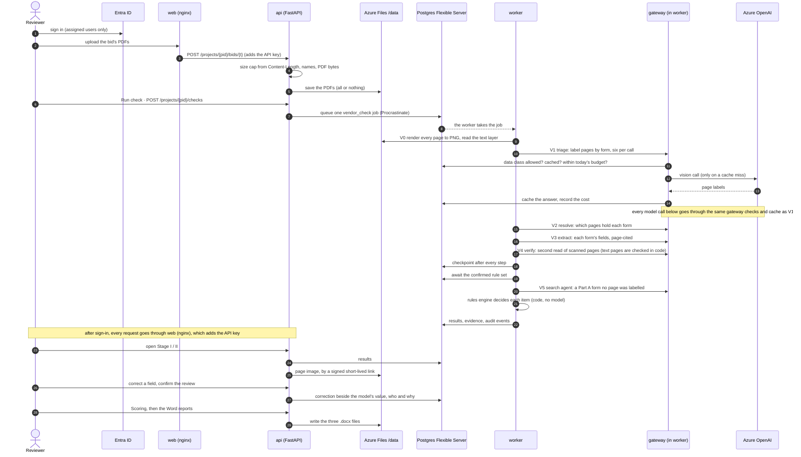

# The shared demo on Azure

One private demo of the whole stack (checklist G4), on synthetic data only:

```
browser ─ Entra ID sign-in ─ Container Apps app (scales to zero, one replica at most)
                               ├─ web      nginx: the React UI; forwards the API and adds the key
                               ├─ api      FastAPI                        ┐ files on an Azure Files
                               └─ worker   the job queue (same image)     ┘ share at /data
                                              │                  │
                          Postgres Flexible Server B1ms     Azure OpenAI (through the gateway)
```

| File | What it does |
|---|---|
| `main.bicep`, `postgres.bicep` | Every resource except those `setup.sh` makes. Compiled on every pull request that touches this folder. |
| `setup.sh` | Run once from a laptop: the key vault and its secrets, the managed identity, the sign-in and deploy app registrations, a first pass of the template, the synthetic cases, and the repository variables. |
| `deploy.sh` | Deploys one image tag. The workflow runs it; it also works from a laptop. |
| `add_user.sh` | Lets one more person sign in, and with `--contributor` deploy. |
| `../../.github/workflows/deploy-azure.yml` | Run by hand: builds `backend` and `web`, pushes them to the GitHub Container Registry, and deploys through OIDC. |

## How a bid moves through the deployment

From the raw PDF a tenderer submitted to a verdict per schedule item under the confirmed rule set. Every step
names the Azure service it uses. The API and the worker are two containers of the same Container Apps app. Every
model call goes through the gateway (`app/gateway.py`) inside the worker, never straight to Azure OpenAI.



The same diagram as an image: [`docs/images/azure-bid-flow.png`](../../docs/images/azure-bid-flow.png). The Mermaid
block above is its source.

| # | Step | Where it runs | Services it uses |
|---|---|---|---|
| 1 | Sign in | Entra ID in front of the app | Entra ID |
| 2–5 | Upload the bid | `web` → `api` | Container Apps, Azure Files (`/data/projects/{pid}/bids/{t}/`) |
| 6–8 | Queue the check | `api` → `worker` | Postgres (the Procrastinate queue) |
| 9 | V0 render pages | `worker` | Azure Files (PDFs in, PNGs out) |
| 10–14 | V1 triage | `worker` → gateway | Azure OpenAI (vision), Postgres (gateway cache, daily budget, rate limit) |
| 15–17 | V2 resolve, V3 extract, V4 verify | `worker` → gateway | Azure OpenAI; Azure Files (page images) |
| 18–19 | Checkpoint, wait for the rule set | `worker` | Postgres |
| 20 | V5 search agent | `worker` → gateway | Azure OpenAI; Azure Files |
| 21–22 | Decide and store | `worker` (rules engine, code) | Postgres (results, evidence, events) |
| 23–27 | Review and correct | `web` → `api` | Postgres; Azure Files (signed page images) |
| 28–29 | Scoring and reports | `api` | Postgres; Azure Files (the `.docx` files) |

Throughout: the containers read their secrets from **Key Vault** through the managed identity (the API key, the
database URL, the sign-in secret, the image-pull token), and write their logs to **Log Analytics**. The Azure OpenAI
key is the exception: a Container Apps secret that the template reads from the resource (`listKeys`).

**This demo runs synthetic projects only.** The gateway sends a project's text to Azure OpenAI only as its data
class allows, and a real bid is `confidential`, so it stays on local models (the client-site deployment).

## First time
1. **A subscription.** A Free Trial, made with a personal Microsoft account rather than a university one, so the demo outlives the university account. Start it when you're ready to deploy: the trial credit lasts 30 days.
2. **Tools:** `brew install azure-cli`, then `az login` and `gh auth login`.
3. **A token to pull the images:** a classic GitHub token with the `read:packages` scope only, in `GHCR_TOKEN`. It goes straight into the key vault.
4. Run `bash deploy/azure/setup.sh`. `LOCATION` (default `centralus`) and `RG` (default `tender-demo`) can be set first. It registers the seven resource providers a new subscription lacks (this can take a few minutes the first time), and if anything fails it says at which line it stopped. It also checks that Postgres is offered to your subscription in that region before it creates anything there. A Free Trial is refused in several popular regions: on 2026-09-30, eastus2, eastus, westus2 and southcentralus refused ours, and centralus, westus3, northcentralus and canadacentral offered it. A resource group's region can't change, so after a refusal delete the half-made group (`az group delete -n tender-demo --yes`) and run again with another `LOCATION`.
5. Actions tab → **deploy-azure** → **Run workflow**. Then open the address `setup.sh` printed and sign in.
6. Let Nasi in: `bash deploy/azure/add_user.sh <email> --contributor`.

**If the first pass stops at `tender-env` with `ManagedEnvironmentCapacityHeavyUsageError`:** the region has no room for a new Container Apps environment at the moment (centralus refused ours on 2026-09-30). Nothing can be moved, so start again in another region: delete the group, purge the two soft-deleted resources (their names and the region's model quota stay held otherwise), and rerun with another `LOCATION`:

```bash
az group delete -n tender-demo --yes
az keyvault list-deleted --query "[].name" -o tsv                   # then, for each tender-kv-…:
az keyvault purge -n <tender-kv-…> -l <old region>
az cognitiveservices account list-deleted --query "[].name" -o tsv  # then, for each tender-oai-…:
az cognitiveservices account purge -g tender-demo -n <tender-oai-…> -l <old region>
LOCATION=<another region> bash deploy/azure/setup.sh
```

The rerun makes a new name suffix. A rerun into a group that still exists reuses the names of the key vault it finds there, so it needs no `GHCR_TOKEN` either.

**If the first pass stops at the Azure OpenAI resource** ("The specified SKU 'GlobalStandard' for model … is not supported in this region"): a region can list a model and still refuse to deploy it to your subscription. canadacentral did for `gpt-4.1-mini` on 2026-09-30, while canadaeast, westus3, northcentralus and centralus accepted it. Nothing was created, so rerun with the OpenAI resource alone in another region, keeping the rest where it is: `LOCATION=canadacentral OPENAI_LOCATION=canadaeast bash deploy/azure/setup.sh`. To check a region first, validate a deployment without creating it (`az deployment group validate`). `OPENAI_MODEL=… OPENAI_MODEL_VERSION=…` pick another model the same way. `setup.sh` stores all three as repository variables, and the deploy workflow passes them on.

## What it costs
The trial credit covers the first 30 days. To keep the demo after that, upgrade to pay-as-you-go:
- **Postgres B1ms:** the free account covers 750 hours of B1ms and 32 GB a month for 12 months, which is the whole month. After that, it's the one real cost.
- **Container Apps:** the first 180,000 vCPU-seconds and 360,000 GiB-seconds a month are free, and a scaled-to-zero app costs nothing. Awake, the three containers take 2 vCPU and 4 GiB together, so the grant is about 25 hours awake a month.
- **Azure OpenAI:** pay per token; a pay-per-token deployment costs nothing idle.
- **Storage, the key vault and logs:** cents.

**The guardrails, and why each is in the template:**
- `minReplicas: 0`: an always-on replica would run far past the free grant.
- B1ms only: no other Postgres tier is free.
- `openAiSku` allows pay-per-token deployment types only, never provisioned throughput.
- `LLM_DAILY_BUDGET_USD` (default 2): the gateway stops model calls for a project past that amount a day.
- **Also set a budget alert** in Cost Management, for example $10 a month.

## Security
- **Nothing is reachable without sign-in.** The app gets public ingress only when a sign-in app registration is given. nginx adds the API key to every forwarded request, so whoever reaches the app can do anything the API can.
- **Only assigned users get in.** The sign-in registration requires assignment, and `setup.sh` and `add_user.sh` assign.
- **Secrets live in the key vault** and are read by the app's managed identity. The deploy identity is Contributor on the resource group only and holds no secret (OIDC). The Azure OpenAI key is a Container Apps secret that the template reads from the resource.
- **Postgres** has a public endpoint that requires TLS and accepts Azure services only; no client address is allowed in. A private network would need a VNet-integrated environment, which costs more.
- **Synthetic data only.** The gateway's policy lets a cloud endpoint see synthetic projects only. A redacted sample would need its host cleared in `LLM_CLEARED_HOSTS`, which this deployment doesn't set, and a confidential project never reaches a cloud endpoint.

## Taking it down
```bash
az group delete -n tender-demo --yes
az ad app delete --id "$(gh variable get AZURE_SIGNIN_CLIENT_ID)"
az ad app delete --id "$(gh variable get AZURE_CLIENT_ID)"
```
