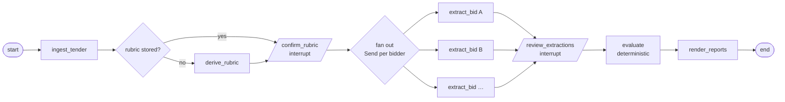

# Agent Upgrade Plan — LangGraph orchestration + a bounded evidence-search agent

*Status: PLAN, not started. Written 2026-08 against commit `85e7562`. Everything below
is a proposal to be confirmed before implementation.*

---

## 0. Summary of the decision

Rebuild **orchestration** on LangGraph (durable state, human-in-the-loop interrupts,
parallel fan-out) and add **one genuinely agentic component** — a bounded, tool-using
evidence-search loop that runs only for findings the pipeline could not settle
("document missing", "unclear"). Everything else stays exactly as it is: the LLM
client, prompts, deterministic evaluation and price engine, report rendering, tests.

Why this shape and not "rewrite it all as an agent":

- The pipeline is a fixed DAG by design; giving an LLM control over *that* would add
  risk and remove the property the client wants (predictable, auditable steps).
- LangGraph's real value here is durable execution + `interrupt()` for the two human
  checkpoints + `Send` for per-bid parallelism — three things currently hand-rolled
  (`status.json`, checkpoint JSON files, a thread pool).
- Agency is only valuable where *search* is the problem: real bids run to hundreds of
  pages, the demo OCRs 8, and keyword retrieval is one-shot. An agent that can decide
  "look at the table of contents, then OCR page 37" fixes a real recall gap — and is
  measurable.

Resulting story (true, defensible in depth): *a LangGraph workflow with durable
human-in-the-loop checkpoints, containing one bounded tool-using sub-agent, with
deterministic guardrails on every number.*

## 1. Goals and non-goals

**Goals**
1. Orchestrate the existing pipeline as a LangGraph `StateGraph` with a SQLite
   checkpointer: resumable, replayable, one thread per project.
2. Human checkpoints (rubric confirmation, extraction review) become graph
   `interrupt()`s — the graph pauses, the UI resumes it.
3. Per-bid extraction fans out with `Send` (replaces the ThreadPoolExecutor).
4. Add `evidence_search` — a bounded ReAct-style loop with read-only tools that
   tries to resolve missing/unclear findings by *finding evidence*, including
   on-demand OCR of pages beyond the initial cap.
5. Prove it: a seeded "buried document" benchmark where the current pipeline
   provably misses evidence and the agent finds it; no regression on the existing
   30-bidder case.
6. Keep the legacy path working behind a flag until the graph path is proven.

**Non-goals**
- No LangChain chat-model layer: nodes are plain Python calling our existing `LLM`
  class (fallback chains, per-hostname keys stay). Only `langgraph` +
  `langgraph-checkpoint-sqlite` are added.
- No change to evaluation, pricing, reports, schemas' meaning, or prompts.
- The agent never decides compliance. It can *find* evidence; verdicts stay with
  deterministic code and the human.
- Stages III–V remain out of scope.

## 2. Current → target

| Concern | Today | Target |
| --- | --- | --- |
| Step order | Hard-coded in `pipeline.py` / `api.py` | `StateGraph` edges (same order) |
| Persistence | `rubric.json`, `bids/*.json`, `status.json` | LangGraph SQLite checkpointer (thread = project id); JSON checkpoint files still written for human editing/compat |
| Human checkpoints | UI polls status, PUTs edited JSON | `interrupt()` in `confirm_rubric` / `review_extractions`; UI resumes with `Command(resume=…)` |
| Parallel bids | `ThreadPoolExecutor(MAX_PARALLEL_BIDS)` | `Send("extract_bid", …)` per bidder; concurrency cap via graph config |
| Unresolved findings | Adversarial verification (one shot) | + `evidence_search` agent loop with tools and budgets |
| Progress | `status.json` written by nodes | Same file, written by nodes (UI unchanged) + graph state inspectable |
| Failure recovery | Re-run job; stored bids skipped | `graph.invoke` resumes from last checkpoint; failed node retried with policy |

## 3. Graph design (`app/graph.py`)



`extract_bid` is itself a small sequence inside the node: load docs (per-page OCR)
→ `extract_bid()` → `verify_extraction()` → **`evidence_search` subgraph** for
remaining missing/unclear findings → write `bids/<name>.json`.

### 3.1 State

```python
class PipelineState(TypedDict, total=False):
    project_dir: str
    tender_files: list[str]
    bidders: list[str]
    rubric: dict | None            # Rubric.model_dump(); None until derived
    rubric_confirmed: bool
    extractions: Annotated[dict[str, dict], merge_dicts]   # reducer for Send fan-in
    agent_traces: Annotated[dict[str, list], merge_dicts]  # per-bid tool-call trace
    review_done: bool
    evaluation: dict | None
    reports: list[str]
    progress: str                  # mirrors status.json detail
```

State holds `model_dump()` dicts, not pydantic objects — keeps the checkpointer
serialization boring and the JSON checkpoint files identical to today.

### 3.2 Nodes (all plain functions, all reuse existing code)

| Node | Calls | Notes |
| --- | --- | --- |
| `ingest_tender` | `load_folder()` | writes progress |
| `derive_rubric` | `derive_rubric()` | skipped by conditional edge if `rubric.json` exists (human-edited wins) |
| `confirm_rubric` | `interrupt({"rubric": …})` | resumes with the (possibly edited) rubric dict → saved to `rubric.json` |
| `extract_bid` | `load_folder`, `extract_bid`, `verify_extraction`, `evidence_search` | one `Send` per bidder without a stored extraction; stored ones pass through |
| `review_extractions` | `interrupt({"extractions": …})` | resumes with corrected dicts; corrected bids flagged final |
| `evaluate` | `evaluate()` | deterministic |
| `render_reports` | `render_all()` | |

### 3.3 Checkpointer and threads

- `SqliteSaver` at `$DATA_DIR/graph.sqlite`; `thread_id = project id`.
- Every node boundary is a checkpoint → a crash mid-run resumes at the last completed
  node; `graph.get_state_history()` gives an audit trail per project (nice UI later).
- Retry policy on LLM nodes: `RetryPolicy(max_attempts=2)` for transient endpoint
  errors (our chain fallback already covers most).

### 3.4 Interrupt protocol with the backend

- `POST /projects/{id}/run` → starts `graph.invoke(state, config)` in a background
  thread; it runs until the first `interrupt()` and stops. `status.json` says
  `"waiting: confirm rubric"`.
- `POST /projects/{id}/resume` with `{"rubric": …}` or `{"extractions": …}` → the
  thread calls `graph.invoke(Command(resume=payload), config)`; continues to the next
  interrupt or the end.
- Existing endpoints (`/rubric/derive`, `/extract`, `/evaluate`, PUTs) stay and keep
  working on the legacy path; the UI switches to run/resume when
  `ORCHESTRATOR=graph`. Once proven, legacy becomes the fallback and later goes away.

## 4. The evidence-search agent (`app/agent.py`, `app/tools.py`)

### 4.1 Trigger

Runs per bid, only for:
- required checklist items with `present=false` **after** verification;
- compliance findings with `complies="unclear"` after verification.

Findings judged `"no"` with quoted evidence are definitive and are not re-litigated.
If a bid has no such findings, the agent never runs (zero cost on clean bids).

### 4.2 Tools (read-only, bounded)

| Tool | Signature | Returns | Guardrail |
| --- | --- | --- | --- |
| `list_pages` | `()` | page number, source (`text`/`ocr`/`skipped`), first-line preview | — |
| `search_pages` | `(query, top_k=5)` | pages + snippets ranked by keyword score (reuses `retrieval._score`) + substring hits | over already-loaded text only |
| `read_page` | `(page)` | full text of a loaded page | — |
| `ocr_page` | `(page)` | OCRs a `skipped` page on demand via the vision chain, cached | budget: `AGENT_OCR_PAGES` per bid (default 6) |
| `finish` | `(found, page, quote, note)` | terminates the loop | quote must appear in the cited page's text (checked in code) |

`ocr_page` is the tool that makes this worth building: today pages beyond
`max_ocr_pages` are simply unreadable; the agent can read the table of contents on
page 1 and go straight to page 37.

### 4.3 Loop mechanics

- **Action selection = structured JSON**, not native function calling: each step the
  model returns one `AgentAction {tool, args, reasoning}` via the existing
  `chat_json()` (schema-validated, one error-feedback retry). Rationale: works
  identically on DeepSeek, Ollama and vLLM regardless of tool-parser support, and
  reuses our validation path. (Native tool calling is a drop-in alternative — both
  `deepseek-chat` and `qwen3:8b` support it — if we ever want the "canonical" look.)
- **Budgets**: `AGENT_MAX_STEPS` per finding (default 6), `AGENT_OCR_PAGES` per bid,
  total wall-clock cap per bid. Exhausting any budget ends with `found=false`.
- **Prompt contract**: the agent is told it is *searching for evidence*, that it must
  quote verbatim, that "not found" is an acceptable answer, and that it must not
  infer presence from other bidders or from what is "normally submitted".
- **Trace**: every step (action, tool result summary) appended to
  `agent_traces[bid]` in state and written to `work/agent/<bid>.json` — shown in the
  UI as "how this evidence was found".

### 4.4 What the agent may change (the guardrail that matters)

| Finding | Agent outcome | Effect |
| --- | --- | --- |
| missing required doc | `found=true` + verified quote/page | `present=true`, note `"found by evidence search: <tool path>"` (same trust level as verification restore) |
| missing required doc | `found=false` | unchanged (stays missing) |
| unclear compliance | `found=true` | evidence + page attached, verdict **stays `unclear`**, `suggested` verdict recorded for the human |
| unclear compliance | `found=false` | unchanged |
| any `"no"` / `"yes"` | never visited | — |

The code-level check that the quote actually appears on the cited page prevents the
one failure mode an LLM search loop is prone to: confidently citing something it
inferred. Verdicts never flip to "yes" by machine.

## 5. Integration points

| File | Change |
| --- | --- |
| `app/graph.py` (new) | `PipelineState`, nodes, `build_graph(cfg, llm, checkpointer)`; `run_project()` helper |
| `app/agent.py` (new) | `evidence_search(extraction, docs, rubric, cfg, llm) -> (extraction, trace)`; `AgentAction`, `AgentFinish` schemas |
| `app/tools.py` (new) | tool implementations over `Document`/`Page` incl. on-demand `ocr_page` with cache + budget |
| `app/ingest.py` | expose `ocr_single_page(path, index, cfg, llm)` (cache-aware) for the tool; `Page.source="skipped"` already exists |
| `app/llm.py` | no change (structured actions reuse `chat_json`) |
| `app/config.py` | `agent_enabled`, `agent_max_steps`, `agent_ocr_pages`, `orchestrator` |
| `backend/api.py` | `POST …/run`, `POST …/resume`, `GET …/graph` (state + history); node progress into `status.json`; legacy endpoints untouched |
| `frontend/ui.py` | Rubric/Extraction pages: "Confirm & continue" resumes the graph; agent-trace expander per bid; badge "found by evidence search" |
| `app/pipeline.py` / `run_demo.py` | `--orchestrator graph` runs the graph with `MemorySaver`; non-interactive mode auto-resumes checkpoints |
| `tools/make_demo_case.py` | `--buried` option (see §6) |
| `backend/requirements.txt` | `langgraph==1.2.11`, `langgraph-checkpoint-sqlite==3.1.1` |
| `docs/` | README section + this plan's status updates |

## 6. Benchmark and acceptance criteria

**Buried-document case** (`make_demo_case.py --buried`): each bid becomes ~16 pages;
the Non-collusive Certificate and the Price Schedule are placed on pages 13–15, and
the bid is scan-only (so with `max_ocr_pages=8` the current pipeline cannot see
them). Page 1 carries a table of contents naming the page numbers — the realistic
signal an agent should exploit. Also seeded: a bid whose certificate is *genuinely*
absent (the agent must return `found=false`).

| Metric | Baseline (today) | Target |
| --- | --- | --- |
| Buried certificate recall | 0% by construction | ≥ 90% |
| Buried price fields extracted | 0% | ≥ 90% |
| False restores (truly-missing doc marked found) | — | 0 |
| Extra OCR pages per bid | 0 | ≤ `AGENT_OCR_PAGES` (6) |
| Existing 30-bidder case | 100% agreement, 287 s | 100%, no slower than before |
| Wall-clock per buried bid | — | reported (expect ~1–3 min local OCR, seconds on cloud text) |

The benchmark script prints a before/after table; it becomes the number quoted in
the README, the slides and the interview doc.

## 7. Tests (all offline, added to the 50)

- **Graph**: stubbed LLM; assert node order, conditional skip when `rubric.json`
  exists, `Send` fan-out produces one extraction per bidder, both interrupts pause
  and resume with edited payloads, checkpoint resume after a simulated crash
  (invoke again with same thread id → continues, no re-extraction).
- **Agent**: `ScriptedLLM` returning a fixed action sequence — (a) finds the buried
  doc via `list_pages → ocr_page → finish`; (b) gives up correctly at
  `AGENT_MAX_STEPS`; (c) `finish` with a quote not on the page is rejected and the
  finding stays missing; (d) unclear compliance gets evidence attached but verdict
  unchanged.
- **Tools**: `search_pages` ranking, `ocr_page` budget + cache, `read_page` on
  skipped page returns a hint to OCR first.
- **API**: run → waiting → resume → waiting → resume → done, through the real graph
  with a stubbed extractor.

## 8. Phases, effort, deliverables

| Phase | Work | Effort | Deliverable / exit criterion |
| --- | --- | --- | --- |
| **A. Graph wrapper** ✅ done | `graph.py`, checkpointer, interrupts, Send fan-out, CLI `--orchestrator graph`, 5 graph tests | ~1 day | **Met**: live graph run on `demo_case` 59 s (3 bids in parallel); legacy replay on the same checkpoints → `evaluation.json` byte-identical; 55 tests green |
| **B. Evidence-search agent** | `tools.py`, `agent.py`, on-demand OCR, budgets, trace, agent + tool tests | ~1.5–2 days | Agent finds the buried certificate in the `--buried` case; 0 false restores |
| **C. Service + UI** | run/resume endpoints, status mapping, UI confirm/resume, trace viewer, `ORCHESTRATOR` flag, API tests | ~1 day | Full flow in the browser on the graph path; legacy path still passes its tests |
| **D. Benchmark + docs** | `--buried` generator, benchmark script, before/after table, README/docs/interview/slides updates | ~0.5 day | Numbers in §6 measured and recorded |

Total ≈ 4–5 working days. Order is fixed: A gives the safety net (identical outputs)
before B changes behaviour; C only after B is measured.

## 9. Risks and mitigations

| Risk | Mitigation |
| --- | --- |
| LangGraph API churn (1.x) | Pin exact versions; keep graph code thin (nodes are our functions) |
| Local 8B model makes poor tool choices | Structured actions with validation retry; small step budget; benchmark on both DeepSeek and qwen3:8b; the agent only *adds* evidence, so poor choices cost time, not correctness |
| Agent "finds" what isn't there | Quote-must-appear-on-page check in code; never flips compliance; trace persisted |
| OCR budget blows up runtime at 60 bidders | Per-bid OCR cap; agent runs only for unresolved findings; cloud vision optional for demo |
| Two orchestration paths drift | Phase A exit criterion is byte-identical outputs; legacy removed once C is stable |
| arm64 (DGX) build | Both new packages are pure Python |
| Checkpoint DB grows | One SQLite per data dir, pruned on project delete |

## 10. Dependencies

- `langgraph==1.2.11`, `langgraph-checkpoint-sqlite==3.1.1` (pure Python; verified
  available 2026-08). No `langchain`, no `langchain-openai`.
- Python 3.12 (CI) / 3.13 (local) — both supported.

## 11. What this buys for interviews (and what it doesn't)

Legitimate claims after Phase D:
- "Orchestrated a multi-step LLM pipeline as a LangGraph state graph with durable
  checkpoints and human-in-the-loop interrupts; per-bid parallelism via `Send`."
- "Designed a bounded tool-using agent (structured actions, read-only tools,
  step/OCR budgets, quote-verification guardrail) that raised buried-evidence recall
  from 0% to ≥90% with zero false positives on a seeded benchmark."
- "Kept every numeric decision deterministic — agent proposes evidence, code and
  humans decide" — the guardrails-next-to-agentic-workflows story.

Not claimable, and the docs will say so: the top-level flow is a workflow, not an
autonomous agent — deliberately. Expect the question "why not let the agent plan the
whole evaluation?" and answer with §0.

## 12. Decisions (confirmed 2026-08 unless marked open)

1. **Agent loop = structured JSON actions** — ✅ confirmed. Endpoint-agnostic,
   reuses `chat_json` validation; native tool calling stays a possible later switch.
2. **Agent may auto-restore a missing document** when it finds a quote verified to
   appear on the cited page — ✅ confirmed (same trust level as the verification
   pass; compliance verdicts still never flip).
3. **`status.json` vs graph state** — open; plan assumes keeping both during
   Phases A–C so the UI's polling contract stays untouched.
4. **Legacy orchestration path is removed after Phase C** — ✅ confirmed; it stays
   as the safety net during A–C only.

**Implementation started 2026-08: Phase A complete; Phase B next.**
