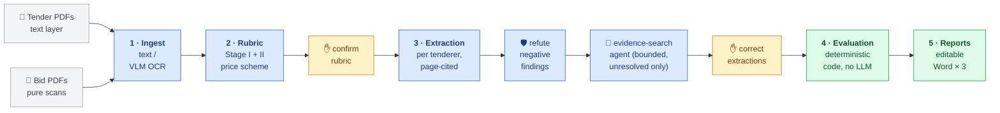

# The prototype pipeline and its measurements (retired at S5)

*Archived 2026-09-30 by the S5 legacy removal (checklist J11-7). The first version of this project was
one LangGraph run with two human checkpoints: a rubric derived from the tender, bid extraction with
verification and a bounded evidence-search agent, then a deterministic evaluation and the Word reports,
driven from a Streamlit UI. The current system (a confirmed rule set, a vendor check per tenderer on a
job queue, the React review UI) replaced it; decision 0001 records why. The prototype's code is in git
history before the removal. The sections below are the README's, as they were, and their numbers are
the prototype's, as measured then.*

## The prototype's flow (mirrors the TAP workflow)

This is the prototype's flow, still served by the legacy routes until the S5 legacy removal
(checklist J11-7). The current system is the one under Architecture above.

🔵 LLM reads &nbsp;·&nbsp; 🟢 deterministic code computes &nbsp;·&nbsp; 🟡 human decides —
rubric derives Stage I checklist, Stage II essential requirements and the price formula
from *this* tender's documents; extraction cites file + page for every fact; evaluation
covers both stage matrices plus rounding, FX, arithmetic tally and ranking. The whole
flow runs as a **LangGraph state graph** (`app/graph.py`): durable per-project
checkpoints, the two human checkpoints as `interrupt()`s, bids fanned out in parallel.
The agent step is the only place an LLM chooses its own actions — and it is bounded:
read-only tools, step and OCR budgets, quotes verified on the cited page.

Design principles:

- **LLMs extract and classify; code calculates and ranks.** All arithmetic (totals,
  cost-effectiveness `D × M`, 2-significant-figure rounding, rankings, FX conversion,
  quoted-total tally check) is deterministic Python.
- **Every tender is different** → the rubric is *derived from the tender documents* per
  project, and is saved as editable JSON (`rubric.json`) for human confirmation before
  evaluation.
- **Evidence-first**: extracted facts carry page references; the evaluation record sheet
  shows them so the Tender Assessment Panel can verify every cell.
- **Citations are grounded in code** (`app/grounding.py`): a finding that cites a page
  nobody read is demoted (present → missing, yes/no → unclear); verification
  refutations and agent results must quote text that appears on the cited page.
- **Bounded agency** (`app/agent.py`): the top-level flow is a fixed workflow. The one
  agentic step — evidence search for findings still missing/unclear after
  verification — picks its own tool calls (list/search/read pages, OCR a page on
  demand) under step and OCR budgets, can only *add* verified evidence, and never
  changes a compliance verdict.

## How it ran

**The prototype's flow (legacy routes, removed at S5, J11-7).** The Streamlit UI that drove it is gone; the routes
remain until the legacy removal. It was **one orchestrated run with two human checkpoints** (`POST /run`,
`POST /resume`): upload documents → *Run* derives the rubric and pauses → review it
(every item shows its source citation — file, page, quoted clause — next to a
rendered tender-page preview; edit the JSON if needed) → *Confirm & continue*
extracts all bids in parallel, verifies them and runs the evidence-search agent on
whatever is still unresolved, then pauses → triaged review (negative findings first
with 🔴/🟠 badges, passed checks collapsed, 🔎 marks evidence the agent found, its
step trace in an expander, jump-to-cited-page preview) → *Confirm & continue*
evaluates and renders the Word reports. Edits made while paused are picked up on
resume; corrected bids are never re-extracted. Layers that run automatically:

- **Targeted retrieval** (`app/retrieval.py`): pages are keyword-scored and only the
  relevant ones enter the prompt — a Price Schedule on page 40 of a 300-page bid is
  found, not truncated away.
- **Adversarial verification** (`app/verify.py`): every negative finding (document
  missing / non-compliant) gets an independent refutation attempt before it can reach
  a report; refuted "missing" is restored with evidence, refuted "non-compliant" is
  demoted to *unclear* for human clarification — never auto-passed. Disable with
  `VERIFY_FINDINGS=0`.
- **Per-page OCR routing** (`app/ingest.py`): the text-vs-scan decision is per page,
  so a digital document with a scanned annex OCRs only the annex, and a scan with an
  embedded text layer on some pages skips OCR there.
- **Parallel extraction** (`app/graph.py`): bids without a stored extraction fan out
  as parallel graph branches (`MAX_PARALLEL_BIDS`, default 4) — cloud endpoints scale
  with it; a local Ollama simply queues the requests. 30 bidders: 82.6–115 s end to end
  on the cloud text models (measured table below; 116 s on the 2026-09-03 run).
- **Citation grounding** (`app/grounding.py`): "present on page 11" is not accepted if
  page 11 was never read — the finding is demoted so verification and the agent
  actually look. Refutations and agent results must quote text on the cited page.
- **Evidence-search agent** (`app/agent.py`, `app/tools.py`): for findings still
  missing/unclear after verification, and for a price the first pass never saw, a
  bounded tool-using loop reads the contents page, OCRs the pages it points to (on
  demand, within `AGENT_OCR_PAGES`), and finishes only with a quote verified on that
  page. `AGENT_SEARCH=0` disables it. First measured on the `--buried` case (schedules
  on pages 9–12 of scan-only offers, first pass capped at 4 pages; 2026-09-03 run,
  DeepSeek text + local OCR — the per-provider reruns are in the table further down):

  | run | certificate recall | false restores | price extracted | unclear findings w/ evidence |
  | --- | --- | --- | --- | --- |
  | agent off | 0/2 | 0 | 0/3 | 0/9 |
  | agent on | **2/2** | **0** | **3/3** | **8/9** |

## Measured across providers — Gemini on Vertex AI, DeepSeek, fully local

"Provider-agnostic" is a claim until it is measured. The model layer takes any
OpenAI-compatible endpoint per chain entry (`model@base_url`), and step 2 of the plan
added the two things a real comparison needs:

- **Vertex AI auth.** Google's OpenAI-compatible endpoint takes no API key: requests
  carry a short-lived OAuth token from Application Default Credentials
  (`gcloud auth application-default login`). `app/gcp.py` refreshes it ahead of
  expiry under a lock, because the parallel fan-out calls the model from several
  threads; `key_for()` never hands the AI Studio key to a Vertex host.
- **Cost accounting.** Every call is recorded per bid and per served model — prompt,
  cached and billable output tokens (Gemini's thinking tokens are billed as output,
  DeepSeek's cache hits are cheaper), seconds, dollars from a price table verified
  on the day (`app/usage.py`, overridable with `MODEL_PRICES`). The graph writes
  `work/usage/<bid>.json` and a `summary.json`; `GET /projects/{id}/usage` and the
  evaluation page show **$ per bid**; failed calls (fallbacks) are counted so a
  provider that silently shifted work to the local model cannot skew a number.

Same synthetic cases, same code, three configurations (`tools/stress_test.py --out`,
`tools/benchmark_buried.py`, `tools/ocr_compare.py`, tables by
`tools/compare_runs.py`; prices of 2026-09-09, standard tier):

<!-- STEP2_TABLES_START -->
**30-bidder stress case** (two scan-only bids; agreement = 116 checks against the seeded
ground truth: Stage I and II verdicts, arithmetic flags, unit prices):

| configuration | agreement | wall clock | rubric | extraction | $ total | $ / bid (mean · median) | tokens / bid | model s / bid (median) | failed calls |
| --- | --- | --- | --- | --- | --- | --- | --- | --- | --- |
| Gemini 2.5 Flash on Vertex AI (text + OCR) | 116/116 (100.0%) | 82.6 s | 8.0 s | 72.4 s | $0.1621 | $0.0053 · $0.0047 | 4788 | 6.8 s | 0 |
| DeepSeek-V4-Flash + local qwen3-vl OCR | 116/116 (100.0%) | 115.2 s | 4.0 s | 109.0 s | $0.0303 | $0.001 · $0.0008 | 3294 | 2.9 s | 0 |
| fully local qwen3:8b + qwen3-vl:8b (laptop) | 116/116 (100.0%) | 2731.4 s | 98.4 s | 2631 s | $0.0 | $0.0 · $0.0 | 4145 | 131.3 s | 0 |
| Gemini on Vertex AI, **deployed on Cloud Run** (driven from the laptop through the IAM proxy, 2026-09-10) | 116/116 (100.0%) | 100.9 s (12.8 s of it upload) | 11.0 s | 76.0 s | $0.1621 | $0.0053 · $0.0047 | 4788 | 6.4 s | 0 |

**Buried-evidence benchmark** (12-page scan-only offers, schedules on pages 9–12, first
pass capped at 4 pages):

| configuration | run | certificate recall | false restores | price extracted | unclear w/ evidence | agent OCR pages | time | $ |
| --- | --- | --- | --- | --- | --- | --- | --- | --- |
| Vertex Gemini | baseline | 0/2 | 0 | 0/3 | 0/9 | 0 | 30 s | $0.0323 |
| Vertex Gemini | agent | 2/2 | 0 | 3/3 | 9/9 | 15 | 228 s | $0.1209 |
| DeepSeek + local OCR | baseline | 0/2 | 0 | 0/3 | 0/9 | 0 | 585 s | $0.0038 |
| DeepSeek + local OCR | agent | 2/2 | 0 | 3/3 | 6/9 | 16 | 856 s | $0.0162 |
| fully local | baseline | 0/2 | 0 | 0/3 | 0/9 | 0 | 1106 s | $0.0 |
| fully local | agent (bids 1–2 of 3; 3rd ran away) | 0/2 | 0 | 1/2 | 0/6 | 10 | 3818 s | $0 |

*Fully local agent run: the 3-way-parallel attempt aborted on a 600 s timeout; run sequentially, the 8B model drove the tools for 27 and 37 minutes on bids 1–2 without finding either certificate (both exist on page 11) and restored one price; the third bid — the one with no certificate, where the search must exhaust its budget — ran away twice (14k generated tokens per request, with a 4k and then a 16k context) and was stopped. 0 false restores, no fabricated citation: the guardrails held, the search did not.*

**OCR, page by page** (the benchmark's 36 scanned pages, separate caches):

| chain | served | s / page | $ / page | ground-truth facts found | failed calls |
| --- | --- | --- | --- | --- | --- |
| A `qwen3-vl:8b` | qwen3-vl:8b | 48.7 | $0.0 | 14/14 | 0 |
| B `google/gemini-2.5-flash` | google/gemini-2.5-flash | 3.8 | $0.00105 | 14/14 | 0 |

Transcript similarity A vs B over 36 pages: mean 0.952, median 1.0, min 0.0. Missed by A: none. Missed by B: none. Empty transcripts — A: ['Tenderer_01 p.6']; B: none.

What the numbers say. All three configurations reach the **same verdicts** on both
cases — the deterministic layers decide, the model only extracts. Cloud models finish
30 bidders in under two minutes for **cents per tender** (Gemini ≈ $0.005 per bid,
DeepSeek ≈ $0.001, the rubric included); the fully local 8B stack reaches the same
100% for $0 but took **45 minutes in two passes** on the laptop: with four bids in
parallel a local OCR page exceeded the 10-minute client timeout at bid 29/30, and the
run was resumed from its checkpoints sequentially (`MAX_PARALLEL_BIDS=1`,
`LLM_TIMEOUT_S`) — the checkpointing did exactly what it is for. The local 8B model
also needed one more deterministic guard: it cited a contents entry as evidence for
three checklist items, which grounding now demotes in code — and it cannot drive the
evidence-search agent on this laptop (see the benchmark note; `LLM_MAX_TOKENS` now
bounds a runaway generation, and Ollama's default 4k context, which silently
truncated the agent's transcripts, needs a 16k model variant). Local OCR recovered every
ground-truth fact Gemini did, blanked one filler page, and is 13× slower per page.
These laptop numbers bound the *demo*; production inference on the client's DGX is a
different class of hardware. Metered spend for the whole step: **$0.35** (Vertex) +
**$0.05** (DeepSeek).
<!-- STEP2_TABLES_END -->
