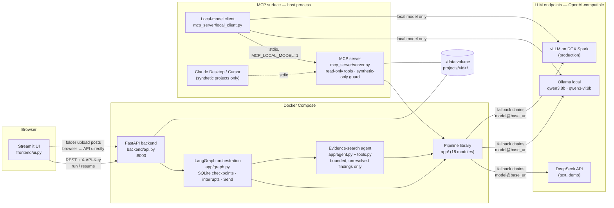

# Tender Evaluation Assistant — Detailed Specification

*Last updated: 2026-09-10 (after the Cloud Run step). Numbers in this document are
measured, not estimated: 88 tracked files, ~5,400 lines of Python plus ~2,000 lines of
tests, 102 offline tests, CI on every push.*

---

## 1. What the system does

The assistant drafts the **procurement review report** a public Tender Assessment
Panel (TAP) produces when evaluating a tender: it ingests one tender document set plus
one offer (bid) per tenderer (20–60 in production), and outputs three editable Word
deliverables — the Price Summary table, the Stage I/II summary list, and a detailed
evaluation record sheet with page-cited evidence.

Scope of this phase: **Stage I (completeness)**, **Stage II (essential requirements)**
and the **price summary**. Stages III–V (technical marking, price marking, combined
score) are phase 2 — Stage III is blocked on the client's marking sheet, which is
missing from the provided materials.

Two facts about the input data shaped the whole design:

1. **Bid documents are pure scans** (zero extractable characters) while tender
   documents carry text layers → vision-model OCR is mandatory, not optional.
2. **Every tender defines its own rules** — which documents must be submitted, which
   requirements are "essential", and the price formula (cost-effectiveness `D × M`
   vs. unit price × quantity) all come from that tender's Terms of Tender → the
   evaluation rubric cannot be hard-coded; it must be *derived from the documents,
   per project*, and confirmed by a human.

## 2. Design principles

- **LLMs extract and classify; code calculates and ranks.** No total, rounding,
  ranking, FX conversion or tally check is ever produced by a model — all arithmetic
  is deterministic Python (`pricing.py`, `evaluate.py`).
- **Evidence-first.** Every extracted fact carries a file + page citation; the UI can
  render the cited page with the quoted sentence highlighted.
- **Human checkpoints.** The derived rubric must be reviewed before extraction; every
  extraction can be corrected, and corrections are final (never re-extracted).
- **Negative findings must survive attack.** Every "document missing" / "non-compliant"
  verdict gets an adversarial refutation pass before it can reach a report.
- **Citations are grounded in code.** A claim that cites a page nobody read is not
  evidence — it is demoted so the pipeline actually looks. Refutations and agent
  results must quote text present on the cited page.
- **Bounded agency.** The top-level flow is a fixed workflow orchestrated as a
  LangGraph state graph. Exactly one step lets an LLM choose its own actions — the
  evidence-search agent — and it runs only for unresolved findings, with read-only
  tools, step/OCR budgets, and no power over compliance verdicts.
- **Local-first, cloud-optional.** The NDA forbids real client documents on any cloud
  path. The demo uses cloud text models on *synthetic data only*; production is the
  same stack pointed at local vLLM on the client's DGX Spark (GB10, arm64).

## 3. Architecture overview

Four deployable pieces, one library:

| Piece | Role | Depends on |
| --- | --- | --- |
| `app/` | The pipeline library — all document/LLM/evaluation logic, the graph and the agent | openai, pydantic, pypdf, pypdfium2, pillow, python-docx, langgraph (+ sqlite checkpointer) |
| `backend/` | FastAPI service: projects, uploads, background jobs, reports API | fastapi, uvicorn + `app/` |
| `frontend/` | Streamlit review UI — a pure HTTP client of the backend | streamlit, requests only |
| `mcp_server/` | MCP server over the read-only tools (stdio; guarded HTTP) + local-model client | mcp 2.2 + `app/` |

The frontend never imports pipeline code and never touches documents (except the
browser-direct folder upload, which posts straight to the API). Requirements are split
per service; the root `requirements.txt` is the dev aggregate (both + pytest).

## 4. Repository inventory (88 tracked files)

| Path | Files | LOC (py) | Contents |
| --- | --- | --- | --- |
| `app/` | 19 | ~2,270 | Pipeline library (18 modules + `__init__`) incl. graph, agent, tools, grounding, gcp, usage |
| `backend/` | 4 | 697 | `api.py`, Dockerfile, requirements, `__init__` |
| `frontend/` | 3 | 683 | `ui.py`, Dockerfile, requirements |
| `mcp_server/` | 3 | ~630 | MCP server (393), local-model client (237), `__init__` |
| `test/` | 21 | ~1,980 | 15 test modules, 102 tests, fixtures, conftest |
| `deploy/cloudrun/` | 5 | — | Private Cloud Run packaging: nginx ingress config + Dockerfile, `cloudbuild.yaml`, idempotent `setup.sh`, `deploy.sh` |
| `tools/` | 8 | ~930 | Case generator (incl. `--buried`, ground truth), PDF generator, stress driver, evidence-search benchmark, case scorer, OCR comparison, results tables |
| `demo_case/` | 5 | — | Committed synthetic demo PDFs (2 tender, 3 bids) |
| `docs/` | 10 | — | `plan.md` (product plan, agent upgrade, experiments, next steps), interview prep, this spec, `report.md` (full project audit: results provenance, engineering quality, risks), `mcp_traces/` (5 experiment traces + index) |
| root | 10 | 85 | `run_demo.py` CLI, compose file, CI workflow, `.env.example`, `.streamlit/config.toml`, README, ignore files (incl. `.gcloudignore`) |

Not tracked: `data/` (projects), `inbox/`, `cache/`, `output/`, `.env`, the
regenerable `buried_case/` and `demo_case_stress/`.

## 5. The pipeline library — module by module

### `app/config.py` (125 LOC)
Environment loading and model configuration. `Config` dataclass fields: `base_url`
(default from `GITHUB_MODELS_BASE_URL` — historic name, now usually the local Ollama
URL), `text_model` / `vision_model` + `*_fallbacks` lists, `cache_dir`, prompt budgets
(`max_ocr_pages=8`, `max_doc_chars=15000`, `max_total_chars=45000`), `verify_findings`,
`max_parallel_bids`, and the agent knobs (`agent_enabled`, `agent_max_steps`,
`agent_ocr_pages`). Two notable functions:
- `load_dotenv()` — minimal `.env` parser, never overrides existing env vars.
- `Config.key_for(base_url)` — **API key selected by endpoint hostname**
  (`DEEPSEEK_API_KEY`, `GEMINI_API_KEY`, `DASHSCOPE_API_KEY`, `ZHIPU_API_KEY`,
  `GITHUB_TOKEN`), so one fallback chain can span providers with different credentials.

### `app/llm.py` (197 LOC)
The only file that talks to a model. One `LLM` class over the OpenAI SDK:
- **Chain entries** are `"model"` (served from `cfg.base_url`) or `"model@base_url"`
  — the `@` form lets a fallback live on a different endpoint entirely (cloud primary,
  local safety net). Clients are created lazily per endpoint.
- `_complete()` iterates the chain; any `OpenAIError` logs one stderr line and falls
  through to the next entry. o-series reasoning models get no `temperature` param.
- `chat_json(system, user, out_model)` — JSON-mode chat **validated against a pydantic
  model**; on `ValidationError` the error text is fed back to the model for exactly one
  retry. The pydantic schema itself is embedded in the system prompt.
- `ocr_page(png_bytes)` — one page transcription to Markdown via the vision chain
  (prompt forbids translation/summarising/inventing; `[REDACTED]` convention).
- **Schema-enforced output** (`LLM_JSON_SCHEMA=1`): the pydantic schema is sent as
  `response_format={"type": "json_schema"}` so a server with guided decoding (vLLM,
  Ollama, Gemini) cannot emit a malformed object or run away; an endpoint that rejects
  it (HTTP 400 — DeepSeek) is retried once as `json_object` on the same model rather
  than falling through the chain. Off by default so the measured runs stay comparable.
- **Context guard** (`LLM_CONTEXT_TOKENS`): `estimate_tokens()` (≈1 token per CJK
  character, 3.5 characters per token otherwise, text parts only) refuses a prompt
  above the server's window with a clear error before any request — the alternative,
  Ollama's default, is silent truncation and a confidently wrong answer (§11).

### `app/schemas.py` (131 LOC)
All data contracts, in pydantic v2. LLM-facing models double as the JSON Schema sent
to the model, so output is validated at the boundary:
- `Rubric` = `stage1_checklist: [ChecklistItem]` + `stage2_requirements:
  [EssentialRequirement]` + `price_scheme: PriceScheme`. Checklist items and
  requirements carry `source_clause` / `source_file` / `source_page` citations.
- `BidExtraction` = `documents: [DocumentPresence]` + `compliance:
  [ComplianceFinding]` (`complies: yes|no|unclear` + evidence quote + page) +
  `BidPrice` (unit price, optimal dosage, quoted total, FX rate).
- Evaluation results: `Stage1Result`, `Stage2Result`, `PriceRow`, `EvaluationResult`.

### `app/ingest.py` (191 LOC)
PDF → per-page text. `classify_pdf` samples up to 5 pages, `SCAN_THRESHOLD=100`
chars/page average. `load_pdf` makes the text-vs-scan decision **per page**: pages
with a text layer are read directly; sparse pages that carry an image XObject are
OCR'd (per-page on-disk cache keyed by file SHA, at most `max_ocr_pages` per doc);
imageless sparse pages (blank separators) are kept as-is. `render_page_png` renders
evidence pages via pypdfium2 and, given a `highlight` quote, locates it with pdfium
text search (full quote, then shorter leading word-runs — LLM quotes rarely match
verbatim) and draws a translucent yellow marker over its line rectangles.

### `app/retrieval.py` (96 LOC)
Keyword-targeted page selection — the answer to "don't blindly truncate a 300-page
bid". Pages are scored by keyword families (`RUBRIC_KEYWORDS` for tender docs;
`BID_BASE_KEYWORDS` ∪ significant words of *this rubric's* items for bids) and the
prompt budget is filled with the highest-scoring pages, first page always kept,
`[Page N]` markers preserved so citations stay valid. Documents that fit the budget
pass through whole.

### `app/rubric.py` (62 LOC)
Tender understanding → `Rubric`. Prioritises files by name ("terms of tender",
"supplement", "special conditions"…), builds a retrieval excerpt, and prompts for the
checklist / essential requirements / price scheme **with source citations** (file,
`[Page N]`, quoted clause). Saved as editable `rubric.json` — the human checkpoint.

### `app/bid_extract.py` (70 LOC)
Per-bid extraction against the rubric. The prompt encodes the hard-won rules:
`present=true` only if the offer text explicitly mentions the document (quote the
sentence); numeric limits compared by direction ("delivery in 30 days complies with
'within 45 days'"); `[REDACTED]` is masked-not-missing; a contents entry is not evidence; never guess
numbers. Output is passed through `ground_extraction` before it is returned.
`extract_price` is the targeted price-only re-extraction the agent triggers after it
has read a Price Schedule the first pass never saw.

### `app/verify.py` (98 LOC)
The adversarial second pass. For every negative finding, an independent prompt tries
to **refute** it from the same documents: a refuted "missing" is restored (with the
evidence noted); a refuted "non-compliant" is demoted to *unclear* for human
clarification — never auto-passed; evidence-free refutations are ignored, and so
are refutations whose quote is not actually on the cited (read) page.

### `app/evaluate.py` (120 LOC)
Deterministic Stage I/II matrices and TAP-style English conclusions. "Unclear"
findings route to clarification, not disqualification. No LLM involved.

### `app/pricing.py` (84 LOC)
The deterministic price engine, mirroring the client's real report behaviour:
`round_2sf` (Decimal, ROUND_HALF_UP at the third significant digit, per Terms of
Tender ¶19), cost-effectiveness `D × M` or unit-price × quantity, FX conversion,
arithmetic tally check (quoted total vs computed, tolerance 0.5), and ranking —
**non-conforming bids are still ranked** but never recommended; the recommended offer
is the best-ranked *conforming* one.

### `app/report.py` (216 LOC)
python-docx rendering of the three deliverables: `price_summary.docx` (two formats —
cost-effectiveness table or unit-price/estimated-goods-price table), `summary_list.docx`
(Stage I/II conclusions), `evaluation_record.docx` (per-tenderer evidence sheet).
Notes (arithmetic errors, non-conforming ranks) are auto-generated. Documents are
rendered to memory and written with one sequential `write_bytes` — python-docx's zip
writer seeks backwards, which a FUSE-mounted bucket (Cloud Run) only accepts through a
slow out-of-order-write fallback.

### `app/grounding.py` (93 LOC)
The deterministic guardrail behind every citation. `readable_pages()` is the set of
pages that were actually read; `ground_extraction()` demotes first-pass findings that
cite any other page (present → missing, yes/no → unclear); `cited_ok()` /
`quote_on_page()` require a verbatim quote (whole, or any 6-word window — tolerant of
OCR edge noise) to appear on the cited page. Used after extraction, by every
verification refutation, and by every agent `finish`. It exists because the first
benchmark run caught the first pass claiming "present on page 11" without having read
page 11.

### `app/tools.py` (114 LOC)
The agent's read-only tools over one bid's `Document`s: `list_pages` (file, number,
source `text|ocr|skipped`, preview), `search_pages` (keyword-scored over pages already
read), `read_page`, and `ocr_page` — read a `skipped` page on demand through the
vision chain, cached, within a per-bid budget. Tools mutate the in-memory pages so
later steps and the final quote check see the new text; nothing is written but the
OCR cache.

### `app/agent.py` (165 LOC)
The bounded evidence-search agent. Runs per bid only for required documents still
missing and compliance findings still "unclear" after verification, plus a price the
first pass never saw. Each step the model returns a schema-validated `AgentAction`
(tool + args, or `finish`) via the same `chat_json` path as everything else — no
native tool-calling dependency, so it behaves identically on DeepSeek, Ollama and
vLLM. The transcript starts with an initial observation (page listing + the cover/
contents page), so the agent follows a table of contents instead of reading pages
sequentially. Guardrails: `AGENT_MAX_STEPS` per finding, `AGENT_OCR_PAGES` per bid,
`finish(found=true)` accepted only if the quote is on the cited page. Outcomes: a
missing document is restored with the verified quote; an unclear finding gets the
evidence and a *suggested* verdict attached but stays unclear; a found Price Schedule
triggers a targeted `extract_price`. Every step is traced to `work/agent/<bid>.json`.

### `app/graph.py` (275 LOC)
LangGraph orchestration of the whole pipeline. `PipelineState` holds paths, the
rubric, per-bidder extractions (dict reducer for fan-in), corrections, evaluation and
a progress log. Nodes wrap the existing functions unchanged: `load_checkpoints`
(stored rubric / extractions from disk win) → `derive_rubric` → `confirm_rubric`
(`interrupt()`) → `extract_bid` (one `Send` per bidder without a stored extraction —
load, extract, verify, evidence search, write `bids/<name>.json`) →
`review_extractions` (`interrupt()`; on resume, payload overrides and any
`bids/*.json` edited on disk count as corrections) → `evaluate` → `render_reports`.
`interactive=False` (CLI) turns the interrupts into pass-throughs. Concurrency comes
from `max_concurrency` = `MAX_PARALLEL_BIDS`. A crash mid fan-out resumes from the last
checkpoint with the finished bids kept.

### `app/pipeline.py` (62 LOC)
Shared helpers: `discover_bidders` (one folder or loose PDF per tenderer),
`run_offline` (the deterministic half from JSON fixtures — zero network) and the
console `summarize`. Checkpoint files (`rubric.json`, `bids/*.json`,
`agent/*.json`, `evaluation.json`, `reports/`) are human-editable between runs;
delete one to redo that step.

### `app/gcp.py` (54 LOC) — Vertex AI auth
Vertex AI's OpenAI-compatible endpoint takes no API key: `ADCToken` wraps Google
Application Default Credentials (workstation login or the attached service account
on Cloud Run) and hands out a bearer token, refreshing it under a lock five minutes
before expiry — the parallel fan-out calls the model from several threads. `LLM`
detects `aiplatform.googleapis.com` entries and sets the token on the client before
each call; `Config.key_for()` returns nothing for that host so the AI Studio key
(`GEMINI_API_KEY`, `generativelanguage.googleapis.com`) can never be sent to Vertex.
`google-auth` is imported lazily, so it is only needed when a Vertex entry is in a chain.

### `app/usage.py` (199 LOC) — token, call and cost accounting
`UsageLedger` lives on the `LLM` client and records every call under the current
*scope* (a thread-local set by `llm.scope(name)` — one bid, or "rubric") and chain
entry, with the model the provider says it served: calls, failed calls, prompt /
cached / billable output tokens, seconds, USD. Billable output is `total − prompt`
when the provider reports a total (Gemini bills its thinking tokens as output);
DeepSeek's cache-hit tokens are priced at the cached rate. Prices are USD per 1M
tokens from `DEFAULT_PRICES` (verified 2026-09-09 against the providers' pages),
overridable via `MODEL_PRICES`; unknown (local) models cost $0. `write_usage` and
`summarize_usage` produce `work/usage/<bid>.json` and `summary.json` — $ per bid
(mean, median), tokens and calls per bid, median model seconds per bid, failed
calls, served models — which the API and UI expose.

### `mcp_server/server.py` (404 LOC) — the tools as an MCP server
`MCPServer` from the official `mcp` SDK 2.2 exposing nine read-only tools (all
annotated `readOnlyHint`): navigation — `list_projects`, `list_bids(project)`,
`get_rubric(project)`, `select_tender(project)`, `select_bid(project, tenderer)` —
and the agent's `BidTools` one-to-one — `list_pages`, `search_pages(query)`,
`read_page(page[, file])`, `ocr_page(page[, file])`. Documents load with
`load_pdf(cached_only=True)`: text pages read, scanned pages taken from the
pipeline's OCR cache if present, otherwise `skipped` until a client calls `ocr_page`
(budget `AGENT_OCR_PAGES` per selection; the vision client is built lazily, so
listing and reading never need a model or key). The current selection is
per-connection state kept on the server *lifespan* object (the SDK enters it once per
stdio process / HTTP session), so nothing is registered globally or leaked.

The confidentiality guard is a `Policy(transport, local_model)` object consulted by
every navigation tool: a project is served only if `meta.json` has
`"synthetic": true`; unflagged projects are withheld from `list_projects` (only a
count is shown) unless the server was started with `MCP_LOCAL_MODEL=1`, the
operator's declaration that the connected client's model runs on-premises; the HTTP
transport (`--transport http`, only with `ALLOW_CLOUD_CLIENTS=1` and `API_KEY`) binds
to loopback, checks `X-API-Key` in an ASGI middleware and serves synthetic projects
only regardless. The server writes nothing but the OCR cache and never prints to
stdout (the stdio transport owns it; logs go to stderr). `--list` prints what the
current policy would serve.

### `mcp_server/local_client.py` (255 LOC) — the production-compatible client
Launches the server as a stdio subprocess with `MCP_LOCAL_MODEL=1` and drives the
tools with the project's own `LLM` class on a *local* endpoint (default
`qwen3:8b@http://localhost:11434/v1`; cloud endpoints are refused unless
`--allow-cloud-model`, meant for synthetic demos). The loop mirrors the agent's:
`ClientAction` (schema-validated JSON, `chat_json` retry), an initial observation
(`select_bid` / `list_bids` / `list_projects` without spending a step), a step
budget, and a quote-on-page check — `finish(found=true)` is accepted only if the
quote appears on a page this client read through `read_page`/`ocr_page`; otherwise
the step is rejected and the model must read the page or finish with `found=false`.
Output: answer, page, quote, step count, seconds and the full trace (`--trace`).

## 6. Backend service — `backend/api.py` (697 LOC)

Project-based REST API. Data layout: `$DATA_DIR/projects/<id>/` with `meta.json`,
`tender/*.pdf`, `bids/<tenderer>/*.pdf`, and `work/` (rubric, extractions, evaluation,
reports, caches, `status.json`).

| Area | Endpoints |
| --- | --- |
| Projects | `POST/GET /projects`, `GET/DELETE /projects/{id}` (delete 409s while a job runs) |
| Uploads | `POST …/tender`, `POST …/bids/{tenderer}` (PDF-only, filename sanitised) |
| Server inbox | `GET /inbox`, `POST …/import` (case/tender/bids kinds, path-traversal guarded) |
| Orchestrated run | `POST …/run` starts the graph in a background thread (SQLite checkpointer, thread = project) and pauses at the first checkpoint; `POST …/resume` continues past a pause; `GET …/graph` = pending checkpoint, progress, corrections |
| Rubric | `GET/PUT …/rubric` (checkpoint; edits while paused are picked up on resume) |
| Extraction | `GET/PUT …/bids/{t}/extraction` (corrections win, never re-extracted); `GET …/bids/{t}/agent` = evidence-search trace |
| Evaluation | `POST …/evaluate` (deterministic re-evaluation of stored extractions, no LLM), `GET …/evaluation` |
| Reports | `GET …/reports`, `GET …/reports/{name}` |
| Evidence | `GET …/bids/{t}/page`, `GET …/tender/page` — rendered PNG, `?highlight=` marks the quoted text, cached |
| Misc | `GET /health`, `GET …/status`, `GET …/usage` (per-bid tokens, calls, $ — see `app/usage.py`) |

Operational design points:
- **Background jobs**: one thread per job, one job per project (`_running` set +
  lock). Status is flipped to `running` *before* the POST returns — closing a race
  where a fast poller saw the previous job's terminal state. Job states: `running`,
  `waiting` (paused at a human checkpoint), `done`, `error`. `status.json` is written
  atomically (temp file + rename) because it is rewritten per progress line while
  the UI polls it.
- **Parallel extraction** happens inside the graph (`Send` fan-out, `max_concurrency`
  = `MAX_PARALLEL_BIDS`); stored/corrected extractions are never re-extracted or
  re-verified.
- **Auth**: optional `API_KEY` → `X-API-Key` header on everything except `/health`.
  The two page-image endpoints also accept `?key=` (browser-tab links can't send
  headers); a test pins that the query key does **not** unlock the data API.
- **CORS** open (configurable) because the UI's folder picker uploads browser→API
  (moot on Cloud Run, where the nginx sidecar serves UI and API from one origin).
- **Checkpoint DB on network storage** (`GRAPH_DB_SCRATCH_DIR`): SQLite needs POSIX
  locks and random writes that a FUSE-mounted bucket does not provide, so with the
  variable set the graph's `graph.sqlite` is opened from an instance-local working
  copy — refreshed from the canonical file under `work/` whenever that is newer
  (fresh instance, or scratch disk lost) — and copied back (temp file + rename) after
  every job, in a `finally`. A test wipes the scratch dir between the two human
  checkpoints and resumes without loss.

### Cloud Run packaging — `deploy/cloudrun/`

One private service, three containers sharing localhost: `proxy` (nginx, the only
container with a port; `/api/*` → backend with the prefix stripped, `/*` → Streamlit
with websocket upgrade headers; 512 MB upload limit), `backend` (FastAPI; env:
`DATA_DIR=/data` on the GCS volume, `INBOX_DIR=/data/inbox`, `GRAPH_DB_SCRATCH_DIR`,
Vertex base URL + model names, `API_KEY` from Secret Manager; startup probe on
`/health`) and `frontend` (Streamlit; `BACKEND_URL=http://127.0.0.1:8000`,
`PUBLIC_BACKEND_URL=/api`, CORS/XSRF checks off because nginx forwards the browser's
host). Service settings: `--no-allow-unauthenticated`, custom service account,
`--no-cpu-throttling` (the graph runs in a thread between requests), `min 0 / max 1`
instances, 60-minute request timeout, session affinity, `--depends-on` so nginx starts
last. `setup.sh` is idempotent (APIs, Artifact Registry repo, private single-region
bucket, service account with three scoped roles, random secret never printed, Cloud
Build permissions, inbox seeded with the synthetic cases); `deploy.sh` runs Cloud
Build (`cloudbuild.yaml`, three images in parallel, git-sha tags) and the deploy, then
grants the owner `run.invoker`. Access is through `gcloud run services proxy`.

## 7. Frontend — `frontend/ui.py` (683 LOC)

Five-step wizard over `st.segmented_control` (its selection survives `st.rerun()`,
unlike `st.tabs`) with Back/Next buttons; blue theme accent (`.streamlit/config.toml`),
red reserved for the delete button.

1. **Documents** — folder pickers (`webkitdirectory` HTML component; every PDF in the
   folder tree uploads browser→backend directly; subfolders become tenderers), server
   inbox import, manual upload fallback. A 3-second `st.fragment` polls the project
   and refreshes when contents change.
2. **Rubric** — *Derive rubric ▶* starts the orchestrated run, which pauses here;
   cited overview (each item shows `📄 file · p.N` as a link + quoted clause) beside a
   tender-page preview with jump-to-citation and highlight; raw JSON editor in an
   expander; *Confirm rubric & continue ▶* resumes the run (edits saved via PUT are
   picked up) and moves to the next step.
3. **Extraction review** — the run pauses here after parallel extraction; triaged:
   negative findings first under "⚠️ Needs review" with 🔴/🟠 badges, passed checks
   collapsed in a "✅ Passed checks" expander with 🟢 badges, 🔎 appended where the
   agent found the evidence; the agent's step trace in an expander; every row has a
   🔎 link opening the cited page with the evidence highlighted; per-row editing via
   `st.data_editor`; price fields; evidence side panel with jump-to-cited-page.
   *Confirm extractions & continue ▶* resumes into evaluation.
4. **Evaluation** — filled automatically by the run; a re-evaluate button recomputes
   from stored (possibly corrected) extractions; Stage I matrix, Stage II expanders
   with evidence, ranked price summary in whichever format the scheme dictates.
5. **Reports** — download the three `.docx` files.

Errors from background jobs persist across reruns on every page (a failed job must
stay visible — an early bug hid it behind an immediate rerun).

## 8. Tools, tests, CI

- `tools/pdfgen.py` — dependency-free PDF writer (text layer extracts cleanly with
  pypdf; can embed JPEG pages to fake scans) used by tests and the case generator.
- `tools/make_demo_case.py` — deterministic synthetic case generator (`--bidders N`):
  seeded defects at fixed indices — every 7th-ish bidder omits the non-collusive
  certificate, `i%11==5` breaches shelf life, `i%9==4` has an arithmetic error in the
  quoted total, bidders 2 and 17 are scan-only. Determinism makes stress runs
  verifiable against ground truth.
- `tools/make_demo_case.py --buried` — the evidence-search benchmark case: 12-page
  scan-only offers whose Price Schedule, Particulars, Certificate and Compliance
  Schedule sit on pages 9–12 behind a generic contents entry; bidder 3 truly lacks
  the certificate; `ground_truth.json` written alongside.
- `tools/benchmark_buried.py` — runs the case with the agent off and on (shared OCR
  cache) and prints the scored table (§11).
- `tools/stress_test.py` — API driver that runs an N-bidder case through
  run → resume → resume and reports per-phase timings, ground-truth agreement
  (`tools/score_case.py`) and model cost; `--out` writes a results file.
- `tools/score_case.py` — scores an `evaluation.json` against a case's
  `ground_truth.json` (Stage I verdicts, Stage II verdicts for Stage I passers,
  arithmetic flags, unit prices) — agreement is computed, not eyeballed; the
  generator now writes ground truth for the N-bidder case as well.
- `tools/ocr_compare.py` — transcribes every scanned page of a case with two vision
  chains (separate caches) and reports transcript similarity, ground-truth facts
  found by each, seconds and $ per page.
- `tools/compare_runs.py` — renders the stress / benchmark / OCR result files as the
  Markdown tables published in the README.
- `test/` — **102 tests, all offline** (no network, no tokens, no client data): unit
  tests for pricing/rounding, evaluation, retrieval, verification (incl. grounded
  refutations), grounding, report rendering, per-page OCR routing (mixed text+image
  PDFs), LLM fallback chains (stubbed clients), schema-enforced output and its
  json_object fallback on a 400, the context guard; graph tests (byte-identical
  evaluation vs the offline fixture run, stored checkpoints skipping the LLM,
  pause/resume with edits from payload and from disk, crash recovery mid fan-out);
  agent tests (buried document found via on-demand OCR, unverifiable quote rejected,
  step budget, unclear stays unclear, price re-extraction, zero calls when nothing is
  unresolved); API tests covering the full run/resume flow with stubbed models,
  inbox import, evidence pages with highlighting, auth scoping, the project
  `synthetic` flag and the checkpoint scratch sync surviving a wiped scratch disk
  twice mid-run; MCP tests (`test/test_mcp.py`, 11): every tool over an
  in-process client, on-demand OCR budget and shared cache, "nothing written but the
  cache", the synthetic-only guard in all three policies, the API-key-guarded HTTP
  transport on a real socket, the real server as a stdio subprocess, an OCR outage
  reported to the model instead of swallowed, and the local
  client answering a scripted question — verified quote accepted, unverifiable quote
  rejected twice then "not found", step budget never fabricating an answer, cloud
  endpoints refused.
- `.github/workflows/ci.yml` — the suite runs on every push (Ubuntu, Python 3.12).

## 9. Configuration reference (`.env`)

| Variable | Meaning |
| --- | --- |
| `GITHUB_MODELS_BASE_URL` | Default endpoint for unqualified model names (historic name; typically local Ollama, production vLLM) |
| `TEXT_MODEL`, `VISION_MODEL` | Primary chain entries, `model` or `model@base_url` |
| `TEXT_MODEL_FALLBACKS`, `VISION_MODEL_FALLBACKS` | Comma-separated fallback entries |
| `DEEPSEEK_API_KEY`, `GEMINI_API_KEY`, `DASHSCOPE_API_KEY`, `ZHIPU_API_KEY`, `GITHUB_TOKEN` | Per-provider keys, matched to endpoints by hostname |
| `VERIFY_FINDINGS` | `0` disables the adversarial pass |
| `AGENT_SEARCH`, `AGENT_MAX_STEPS`, `AGENT_OCR_PAGES` | Evidence-search agent on/off (default on), step budget per finding (8), on-demand OCR pages per bid (6) |
| `MAX_OCR_PAGES` | OCR cap per document (demo 8) |
| `MAX_PARALLEL_BIDS` | Concurrent bid extractions in the graph fan-out (default 4) |
| `API_KEY` | Enables auth; required on any shared machine |
| `DATA_DIR`, `INBOX_DIR` | Storage roots (bind-mounted in Docker) |
| `PUBLIC_BACKEND_URL` | What the *browser* can reach (folder upload + evidence links); a relative path such as `/api` behind a same-origin proxy |
| `CORS_ORIGINS` | Allowed browser origins for the API (default `*`; moot behind the Cloud Run nginx sidecar) |
| `MCP_TRANSPORT` | Default for the MCP server's `--transport` (`stdio`) |
| *(Ollama context)* | Ollama serves a 4k context by default and truncates longer prompts silently; use a 16k model variant for the text model (`ollama create qwen3:8b-16k`, see `.env.example`) or `OLLAMA_CONTEXT_LENGTH` |
| `LLM_TIMEOUT_S` | Per-request model timeout (default 600 s); raise for local vision models under load |
| `LLM_MAX_TOKENS` | Optional cap on generated tokens per call (unset by default); bounds a runaway local generation |
| `MODEL_PRICES` | JSON, USD per 1M tokens per model (`in`, `out`, `cached_in`), overriding the built-in table used for $ per bid |
| `LLM_JSON_SCHEMA` | `1` sends the pydantic schema as a `json_schema` response format (server-enforced grammar on vLLM/Ollama/Gemini); endpoints that reject it fall back to `json_object` |
| `LLM_CONTEXT_TOKENS` | The server's context window; a prompt estimated above it is refused with a clear error instead of being silently truncated |
| `GRAPH_DB_SCRATCH_DIR` | Instance-local working dir for the LangGraph SQLite DB when `DATA_DIR` is a FUSE/network mount (Cloud Run); synced back after every job |
| *(Vertex entries)* | `google/gemini-2.5-flash@https://<region>-aiplatform.googleapis.com/v1/projects/<project>/locations/<region>/endpoints/openapi` as `TEXT_MODEL` / `VISION_MODEL`; auth via `gcloud auth application-default login`, no key |
| `MCP_LOCAL_MODEL` | `1` declares an on-premises MCP client: unflagged (real) projects are served over stdio; the local client sets it itself — never for Claude Desktop |
| `ALLOW_CLOUD_CLIENTS`, `MCP_PORT` | Enable the MCP HTTP transport (loopback, `X-API-Key`, synthetic projects only) and its port (8765) |
| `LOCAL_TEXT_MODEL` | Model the local MCP client drives the tools with (must be a local endpoint; default `qwen3:8b@http://localhost:11434/v1`) |

## 10. Security & confidentiality model

- Real client documents **never** leave the network: cloud models are demo-only and
  fed synthetic/sanitised data; production inference is vLLM on the client's DGX
  Spark. The repo is private; `.env` (all keys) is gitignored; only code, tests and
  synthetic fixtures are committed.
- Uploads: PDF-only, filenames sanitised (`_safe_name`); inbox imports resolve paths
  and reject traversal (`is_relative_to`); reports served by sanitised name.
- Auth: `X-API-Key` on all data endpoints; image endpoints additionally accept a
  query key (scoped — tested to not unlock the data API). Keep :8000 firewalled in
  production; users only need the UI on :8501.
- Vertex AI is a cloud path like DeepSeek: synthetic or sanitized documents only.
  Its credentials are OAuth tokens from the operator's own login, never a key in
  `.env`; the project is a personal free-trial project with a budget alert.
- Cloud Run demo: IAM-only ingress (owner is the sole invoker; anonymous → 403
  before the containers), the API behind `X-API-Key` from Secret Manager on top; the
  runtime service account holds three scoped roles (Vertex user, object admin on the
  one private single-region bucket, accessor on the one secret); no provider key
  exists in the cloud; images are built from a whitelisted upload (no data, keys,
  docs or tests). Synthetic projects only — the bucket never holds client documents.
- MCP egress: an MCP server only moves tool execution on-premises — every tool
  result goes to the model driving the client, so cloud-driven clients (Claude
  Desktop, Cursor) equal cloud egress. Enforced in code: projects are served only if
  created with the `synthetic` flag, unless the server is started for an on-premises
  client (`MCP_LOCAL_MODEL=1`, which the bundled local client sets itself); the HTTP
  transport is opt-in, loopback, API-keyed and synthetic-only.

## 11. Verified performance & quality

| Measurement | Result |
| --- | --- |
| 30-bidder stress test, pre-graph (sequential extraction, cloud text) | **287 s** end-to-end, **100%** agreement with seeded ground truth |
| — missing certificates | 4/4 found, incl. one inside a scan-only bid |
| — shelf-life breaches / arithmetic errors | 3/3 and 3/3 flagged |
| — cheapest non-conforming bid | ranked #1 on price, correctly **not** recommended |
| Rubric derivation | 6 s on DeepSeek vs 133 s on local qwen3:8b (2026-08 run; 2026-09-09 stress runs: 4.0 s vs 98.4 s) — same verdicts |
| 3-bid case incl. scanned-bid OCR + verification | 55 s with parallel extraction (~337 s sequential local) |
| Evaluation from stored extractions | ~5 s (no LLM) |
| 30-bidder case through the graph, agent on (2026-09-03 run; the per-provider reruns below are current) | **116 s**, all seeded defects matched; agent ran for the 4 missing-certificate bids and restored nothing |
| Evidence-search benchmark (`--buried`, first pass capped at 4 pages) | certificate recall **0/2 → 2/2**, **0** false restores, price **0/3 → 3/3**, unclear findings with evidence **0/9 → 8/9**, ~6 OCR pages per bid (2026-09-03 run, DeepSeek + local OCR; the Vertex rerun below reached 9/9) |
| Orchestrated run/resume flow (demo case) | rubric derived + paused in 4 s; 3 bids extracted in parallel incl. OCR + agent in 54 s; evaluation + reports 2 s — verified both natively and on the rebuilt Docker stack |
| Mid-project provider retirement (GitHub Models, HTTP 410) | Survived via fallback chain → local Ollama, zero code change |
| MCP tools, same question two ways (`--buried` project, first pass cached pp. 1–4, agent off) | cloud driver (DeepSeek): certificate **found p.11** in 3 steps / 32 s, absent one **not found** in 7 steps; local driver (`qwen3:8b`, cold cache): **found p.11** in 4 steps / 111 s, absent one not found in 3 steps; no run ever produced an unverified citation |
| MCP guard, live | HTTP refused to start without opt-in or key; 401 without key; unflagged project refused even with `MCP_LOCAL_MODEL=1`; synthetic served |
| Three backends, 30-bidder case (Vertex Gemini / DeepSeek + local OCR / fully local) | agreement **100% / 100% / 100%**; wall clock **83 s / 115 s / 45 min (two passes)**; cost **$0.16 / $0.03 / $0** ($0.005 / $0.001 / $0 per bid) |
| Three backends, buried benchmark | Vertex 2/2 certs, 0 false, 3/3 prices, 9/9 evidence in 228 s ($0.12); DeepSeek + local OCR 2/2, 0, 3/3, 6/9 in 856 s ($0.02); fully local baseline 1106 s, 1 first-pass false positive (contents entry → new grounding rule); fully local agent: 0/2 certificates found on the two bids that completed (27–37 min each), 0 false restores, third bid ran away and was stopped |
| Cloud Run deployment, same 30-bidder case through the IAM proxy | **116/116**, **100.9 s** end to end (12.8 s upload, 11.0 s rubric, 76.0 s extraction + evaluation), **$0.162**, 0 failed calls; checkpoint DB synced to the bucket; evidence image 0.8 s; websocket 101; FUSE out-of-order writes on `.docx` (fixed) |
| OCR page by page (36 pages) | qwen3-vl 48.7 s/page, Gemini 3.8 s/page ($0.001); both recover all 14 ground-truth facts; 1 blank local transcript |

## 12. Demo → production mapping and roadmap

| Demo (this repo) | Production (client site) |
| --- | --- |
| DeepSeek API `deepseek-chat` or Gemini 2.5 Flash on Vertex AI (text) | Qwen3.6-35B-A3B / DeepSeek-V4-Flash via vLLM |
| Ollama `qwen3-vl:8b` or Gemini 2.5 Flash (OCR) | Qwen3-VL-30B-A3B page OCR, batched |
| Docker on a laptop | Same compose stack on DGX Spark GB10 (arm64) |
| Private, scale-to-zero Cloud Run service (portability proof, reviewer demo) | Not applicable — production is on-premises by contract |
| Synthetic fixtures | Real tender/bid sets, fully local |

Next milestones: vLLM bring-up on the DGX; golden regression against three real
historical cases (the honest accuracy test); Word template fidelity against the
client's exact formats; batch queue for overnight 60-bidder runs; Stages III–V.
