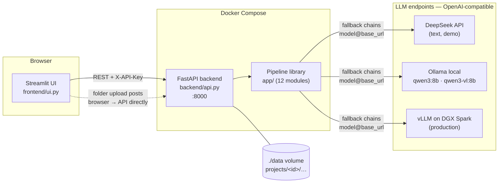

# Tender Evaluation Assistant — Detailed Specification

*Last updated: 2026-08 (commit `4e96b4b`). Numbers in this document are measured, not
estimated: 57 tracked files, ~3,800 lines of Python, 50 offline tests, CI on every push.*

---

## 1. What the system does

The assistant drafts the **procurement review report** a public Tender Assessment
Panel (TAP) produces when evaluating a tender: it ingests one tender document set plus
one offer (bid) per tenderer (20–60 in production), and outputs three editable Word
deliverables — the Price Summary table, the Stage I/II summary list, and a detailed
evaluation record sheet with page-cited evidence.

Scope of this phase: **Stage I (completeness)**, **Stage II (essential requirements)**
and the **price summary**. Stages III–V (technical marking, price marking, combined
score) are phase 2 — Stage III is blocked on the client's marking sheet, which is
missing from the provided materials.

Two facts about the input data shaped the whole design:

1. **Bid documents are pure scans** (zero extractable characters) while tender
   documents carry text layers → vision-model OCR is mandatory, not optional.
2. **Every tender defines its own rules** — which documents must be submitted, which
   requirements are "essential", and the price formula (cost-effectiveness `D × M`
   vs. unit price × quantity) all come from that tender's Terms of Tender → the
   evaluation rubric cannot be hard-coded; it must be *derived from the documents,
   per project*, and confirmed by a human.

## 2. Design principles

- **LLMs extract and classify; code calculates and ranks.** No total, rounding,
  ranking, FX conversion or tally check is ever produced by a model — all arithmetic
  is deterministic Python (`pricing.py`, `evaluate.py`).
- **Evidence-first.** Every extracted fact carries a file + page citation; the UI can
  render the cited page with the quoted sentence highlighted.
- **Human checkpoints.** The derived rubric must be reviewed before extraction; every
  extraction can be corrected, and corrections are final (never re-extracted).
- **Negative findings must survive attack.** Every "document missing" / "non-compliant"
  verdict gets an adversarial refutation pass before it can reach a report.
- **Local-first, cloud-optional.** The NDA forbids real client documents on any cloud
  path. The demo uses cloud text models on *synthetic data only*; production is the
  same stack pointed at local vLLM on the client's DGX Spark (GB10, arm64).

## 3. Architecture overview

Three deployable pieces, one library:

| Piece | Role | Depends on |
| --- | --- | --- |
| `app/` | The pipeline library — all document/LLM/evaluation logic | openai, pydantic, pypdf, pypdfium2, pillow, python-docx |
| `backend/` | FastAPI service: projects, uploads, background jobs, reports API | fastapi, uvicorn + `app/` |
| `frontend/` | Streamlit review UI — a pure HTTP client of the backend | streamlit, requests only |

The frontend never imports pipeline code and never touches documents (except the
browser-direct folder upload, which posts straight to the API). Requirements are split
per service; the root `requirements.txt` is the dev aggregate (both + pytest).

## 4. Repository inventory (57 tracked files)

| Path | Files | LOC (py) | Contents |
| --- | --- | --- | --- |
| `app/` | 13 | ~1,300 | Pipeline library (12 modules + `__init__`) |
| `backend/` | 4 | 566 | `api.py`, Dockerfile, requirements, `__init__` |
| `frontend/` | 3 | 612 | `ui.py`, Dockerfile, requirements |
| `test/` | 16 | ~780 | 10 test modules, 50 tests, fixtures, conftest |
| `tools/` | 4 | ~400 | Synthetic-case generator, PDF generator, stress driver |
| `demo_case/` | 5 | — | Committed synthetic demo PDFs (2 tender, 3 bids) |
| `docs/` | 3+ | — | Presentation + plan reports (+ this spec) |
| root | 9 | 85 | `run_demo.py` CLI, compose file, CI workflow, `.env.example`, `.streamlit/config.toml`, README, ignore files |

## 5. The pipeline library — module by module

### `app/config.py` (83 LOC)
Environment loading and model configuration. `Config` dataclass fields: `base_url`
(default from `GITHUB_MODELS_BASE_URL` — historic name, now usually the local Ollama
URL), `text_model` / `vision_model` + `*_fallbacks` lists, `cache_dir`, prompt budgets
(`max_ocr_pages=8`, `max_doc_chars=15000`, `max_total_chars=45000`), `verify_findings`
flag. Two notable functions:
- `load_dotenv()` — minimal `.env` parser, never overrides existing env vars.
- `Config.key_for(base_url)` — **API key selected by endpoint hostname**
  (`DEEPSEEK_API_KEY`, `GEMINI_API_KEY`, `DASHSCOPE_API_KEY`, `ZHIPU_API_KEY`,
  `GITHUB_TOKEN`), so one fallback chain can span providers with different credentials.

### `app/llm.py` (119 LOC)
The only file that talks to a model. One `LLM` class over the OpenAI SDK:
- **Chain entries** are `"model"` (served from `cfg.base_url`) or `"model@base_url"`
  — the `@` form lets a fallback live on a different endpoint entirely (cloud primary,
  local safety net). Clients are created lazily per endpoint.
- `_complete()` iterates the chain; any `OpenAIError` logs one stderr line and falls
  through to the next entry. o-series reasoning models get no `temperature` param.
- `chat_json(system, user, out_model)` — JSON-mode chat **validated against a pydantic
  model**; on `ValidationError` the error text is fed back to the model for exactly one
  retry. The pydantic schema itself is embedded in the system prompt.
- `ocr_page(png_bytes)` — one page transcription to Markdown via the vision chain
  (prompt forbids translation/summarising/inventing; `[REDACTED]` convention).

### `app/schemas.py` (131 LOC)
All data contracts, in pydantic v2. LLM-facing models double as the JSON Schema sent
to the model, so output is validated at the boundary:
- `Rubric` = `stage1_checklist: [ChecklistItem]` + `stage2_requirements:
  [EssentialRequirement]` + `price_scheme: PriceScheme`. Checklist items and
  requirements carry `source_clause` / `source_file` / `source_page` citations.
- `BidExtraction` = `documents: [DocumentPresence]` + `compliance:
  [ComplianceFinding]` (`complies: yes|no|unclear` + evidence quote + page) +
  `BidPrice` (unit price, optimal dosage, quoted total, FX rate).
- Evaluation results: `Stage1Result`, `Stage2Result`, `PriceRow`, `EvaluationResult`.

### `app/ingest.py` (164 LOC)
PDF → per-page text. `classify_pdf` samples up to 5 pages, `SCAN_THRESHOLD=100`
chars/page average. `load_pdf` makes the text-vs-scan decision **per page**: pages
with a text layer are read directly; sparse pages that carry an image XObject are
OCR'd (per-page on-disk cache keyed by file SHA, at most `max_ocr_pages` per doc);
imageless sparse pages (blank separators) are kept as-is. `render_page_png` renders
evidence pages via pypdfium2 and, given a `highlight` quote, locates it with pdfium
text search (full quote, then shorter leading word-runs — LLM quotes rarely match
verbatim) and draws a translucent yellow marker over its line rectangles.

### `app/retrieval.py` (96 LOC)
Keyword-targeted page selection — the answer to "don't blindly truncate a 300-page
bid". Pages are scored by keyword families (`RUBRIC_KEYWORDS` for tender docs;
`BID_BASE_KEYWORDS` ∪ significant words of *this rubric's* items for bids) and the
prompt budget is filled with the highest-scoring pages, first page always kept,
`[Page N]` markers preserved so citations stay valid. Documents that fit the budget
pass through whole.

### `app/rubric.py` (62 LOC)
Tender understanding → `Rubric`. Prioritises files by name ("terms of tender",
"supplement", "special conditions"…), builds a retrieval excerpt, and prompts for the
checklist / essential requirements / price scheme **with source citations** (file,
`[Page N]`, quoted clause). Saved as editable `rubric.json` — the human checkpoint.

### `app/bid_extract.py` (43 LOC)
Per-bid extraction against the rubric. The prompt encodes the hard-won rules:
`present=true` only if the offer text explicitly mentions the document (quote the
sentence); numeric limits compared by direction ("delivery in 30 days complies with
'within 45 days'"); `[REDACTED]` is masked-not-missing; never guess numbers.

### `app/verify.py` (87 LOC)
The adversarial second pass. For every negative finding, an independent prompt tries
to **refute** it from the same documents: a refuted "missing" is restored (with the
evidence noted); a refuted "non-compliant" is demoted to *unclear* for human
clarification — never auto-passed; evidence-free refutations are ignored.

### `app/evaluate.py` (120 LOC)
Deterministic Stage I/II matrices and TAP-style English conclusions. "Unclear"
findings route to clarification, not disqualification. No LLM involved.

### `app/pricing.py` (84 LOC)
The deterministic price engine, mirroring the client's real report behaviour:
`round_2sf` (Decimal, ROUND_HALF_UP at the third significant digit, per Terms of
Tender ¶19), cost-effectiveness `D × M` or unit-price × quantity, FX conversion,
arithmetic tally check (quoted total vs computed, tolerance 0.5), and ranking —
**non-conforming bids are still ranked** but never recommended; the recommended offer
is the best-ranked *conforming* one.

### `app/report.py` (206 LOC)
python-docx rendering of the three deliverables: `price_summary.docx` (two formats —
cost-effectiveness table or unit-price/estimated-goods-price table), `summary_list.docx`
(Stage I/II conclusions), `evaluation_record.docx` (per-tenderer evidence sheet).
Notes (arithmetic errors, non-conforming ranks) are auto-generated.

### `app/pipeline.py` (114 LOC)
CLI orchestrator (used by `run_demo.py`): every step writes checkpoint JSON
(`rubric.json`, `bids/*.json`, `evaluation.json`) so runs are resumable and
human-editable between steps; delete a checkpoint file to redo that step.
`run_offline()` runs the deterministic half from fixtures with zero network.

## 6. Backend service — `backend/api.py` (566 LOC)

Project-based REST API. Data layout: `$DATA_DIR/projects/<id>/` with `meta.json`,
`tender/*.pdf`, `bids/<tenderer>/*.pdf`, and `work/` (rubric, extractions, evaluation,
reports, caches, `status.json`).

| Area | Endpoints |
| --- | --- |
| Projects | `POST/GET /projects`, `GET/DELETE /projects/{id}` (delete 409s while a job runs) |
| Uploads | `POST …/tender`, `POST …/bids/{tenderer}` (PDF-only, filename sanitised) |
| Server inbox | `GET /inbox`, `POST …/import` (case/tender/bids kinds, path-traversal guarded) |
| Rubric | `POST …/rubric/derive` (job), `GET/PUT …/rubric` (checkpoint) |
| Extraction | `POST …/extract` (job), `GET/PUT …/bids/{t}/extraction` (corrections win) |
| Evaluation | `POST …/evaluate` (job: extract missing → evaluate → render), `GET …/evaluation` |
| Reports | `GET …/reports`, `GET …/reports/{name}` |
| Evidence | `GET …/bids/{t}/page`, `GET …/tender/page` — rendered PNG, `?highlight=` marks the quoted text, cached |
| Misc | `GET /health`, `GET …/status` |

Operational design points:
- **Background jobs**: one thread per job, one job per project (`_running` set +
  lock). Status is flipped to `running` *before* the POST returns — closing a race
  where a fast poller saw the previous job's terminal state.
- **Parallel extraction**: missing bids fan out to a `ThreadPoolExecutor`
  (`MAX_PARALLEL_BIDS`, default 4) with lock-guarded progress written to
  `status.json`; stored/corrected extractions are never re-extracted or re-verified.
- **Auth**: optional `API_KEY` → `X-API-Key` header on everything except `/health`.
  The two page-image endpoints also accept `?key=` (browser-tab links can't send
  headers); a test pins that the query key does **not** unlock the data API.
- **CORS** open (configurable) because the UI's folder picker uploads browser→API.

## 7. Frontend — `frontend/ui.py` (612 LOC)

Five-step wizard over `st.segmented_control` (its selection survives `st.rerun()`,
unlike `st.tabs`) with Back/Next buttons; blue theme accent (`.streamlit/config.toml`),
red reserved for the delete button.

1. **Documents** — folder pickers (`webkitdirectory` HTML component; every PDF in the
   folder tree uploads browser→backend directly; subfolders become tenderers), server
   inbox import, manual upload fallback. A 3-second `st.fragment` polls the project
   and refreshes when contents change.
2. **Rubric** — derive button; cited overview (each item shows `📄 file · p.N` as a
   link + quoted clause) beside a tender-page preview with jump-to-citation and
   highlight; raw JSON editor in an expander as the formal checkpoint.
3. **Extraction review** — triaged: negative findings first under "⚠️ Needs review"
   with 🔴/🟠 badges, passed checks collapsed in a "✅ Passed checks" expander with 🟢
   badges; every row has a 🔎 link opening the cited page with the evidence
   highlighted; per-row editing via `st.data_editor`; price fields; evidence side
   panel with jump-to-cited-page. Saving marks the bid as corrected (never
   re-extracted).
4. **Evaluation** — run button; Stage I matrix, Stage II expanders with evidence,
   ranked price summary in whichever format the scheme dictates.
5. **Reports** — download the three `.docx` files.

Errors from background jobs persist across reruns on every page (a failed job must
stay visible — an early bug hid it behind an immediate rerun).

## 8. Tools, tests, CI

- `tools/pdfgen.py` — dependency-free PDF writer (text layer extracts cleanly with
  pypdf; can embed JPEG pages to fake scans) used by tests and the case generator.
- `tools/make_demo_case.py` — deterministic synthetic case generator (`--bidders N`):
  seeded defects at fixed indices — every 7th-ish bidder omits the non-collusive
  certificate, `i%11==5` breaches shelf life, `i%9==4` has an arithmetic error in the
  quoted total, bidders 2 and 17 are scan-only. Determinism makes stress runs
  verifiable against ground truth.
- `tools/stress_test.py` — API driver that runs an N-bidder case end-to-end and
  reports per-phase timings.
- `test/` — **50 tests, all offline** (no network, no tokens, no client data): unit
  tests for pricing/rounding, evaluation, retrieval, verification amendments, report
  rendering, per-page OCR routing (mixed text+image PDFs), LLM fallback chains
  (stubbed clients), and API tests covering the full project flow, inbox import,
  parallel extraction (stubbed extractor through the real thread pool), evidence
  pages with highlighting, and auth scoping.
- `.github/workflows/ci.yml` — the suite runs on every push (Ubuntu, Python 3.12).

## 9. Configuration reference (`.env`)

| Variable | Meaning |
| --- | --- |
| `GITHUB_MODELS_BASE_URL` | Default endpoint for unqualified model names (historic name; typically local Ollama, production vLLM) |
| `TEXT_MODEL`, `VISION_MODEL` | Primary chain entries, `model` or `model@base_url` |
| `TEXT_MODEL_FALLBACKS`, `VISION_MODEL_FALLBACKS` | Comma-separated fallback entries |
| `DEEPSEEK_API_KEY`, `GEMINI_API_KEY`, `DASHSCOPE_API_KEY`, `ZHIPU_API_KEY`, `GITHUB_TOKEN` | Per-provider keys, matched to endpoints by hostname |
| `VERIFY_FINDINGS` | `0` disables the adversarial pass |
| `MAX_OCR_PAGES` | OCR cap per document (demo 8) |
| `MAX_PARALLEL_BIDS` | Concurrent bid extractions (default 4) |
| `API_KEY` | Enables auth; required on any shared machine |
| `DATA_DIR`, `INBOX_DIR` | Storage roots (bind-mounted in Docker) |
| `PUBLIC_BACKEND_URL` | What the *browser* can reach (folder upload + evidence links) |

## 10. Security & confidentiality model

- Real client documents **never** leave the network: cloud models are demo-only and
  fed synthetic/sanitised data; production inference is vLLM on the client's DGX
  Spark. The repo is private; `.env` (all keys) is gitignored; only code, tests and
  synthetic fixtures are committed.
- Uploads: PDF-only, filenames sanitised (`_safe_name`); inbox imports resolve paths
  and reject traversal (`is_relative_to`); reports served by sanitised name.
- Auth: `X-API-Key` on all data endpoints; image endpoints additionally accept a
  query key (scoped — tested to not unlock the data API). Keep :8000 firewalled in
  production; users only need the UI on :8501.

## 11. Verified performance & quality

| Measurement | Result |
| --- | --- |
| 30-bidder stress test (cloud text, seeded defects) | **287 s** end-to-end, **100%** agreement with seeded ground truth |
| — missing certificates | 4/4 found, incl. one inside a scan-only bid |
| — shelf-life breaches / arithmetic errors | 3/3 and 3/3 flagged |
| — cheapest non-conforming bid | ranked #1 on price, correctly **not** recommended |
| Rubric derivation | 6 s on DeepSeek (133 s on local qwen3:8b — same verdicts) |
| 3-bid case incl. scanned-bid OCR + verification | 55 s with parallel extraction (~337 s sequential local) |
| Evaluation from stored extractions | ~5 s (no LLM) |
| Mid-project provider retirement (GitHub Models, HTTP 410) | Survived via fallback chain → local Ollama, zero code change |

## 12. Demo → production mapping and roadmap

| Demo (this repo) | Production (client site) |
| --- | --- |
| DeepSeek API `deepseek-chat` (text) | Qwen3.6-35B-A3B / DeepSeek-V4-Flash via vLLM |
| Ollama `qwen3-vl:8b` OCR | Qwen3-VL-30B-A3B page OCR, batched |
| Docker on a laptop | Same compose stack on DGX Spark GB10 (arm64) |
| Synthetic fixtures | Real tender/bid sets, fully local |

Next milestones: vLLM bring-up on the DGX; golden regression against three real
historical cases (the honest accuracy test); Word template fidelity against the
client's exact formats; batch queue for overnight 60-bidder runs; Stages III–V.
