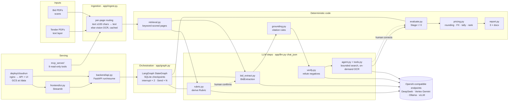

# Project Report — Tender Evaluation Assistant

*Audit basis: the repository at commit `4970042` (2026-09-10), read file by file, with
every number traced to the artifact that produced it. The audit found a set of
mechanical defects (stale defaults pointing at a retired provider, a non-runnable README
command, superseded numbers quoted next to current ones, an unvalidated project id on a
delete path). Those were fixed in the commit that adds this report; §10.7 lists exactly
what changed. Everything else below describes the repository after those fixes.*

*Notation: **[verified]** = read from code or a result file; **[inferred]** = a reasonable
reading not directly evidenced; **[missing]** = the repository does not contain the
information.*

---

## 1. Executive Summary

**What it does.** The Tender Evaluation Assistant drafts the procurement review report a
Hong Kong public Tender Assessment Panel (TAP) produces after a tender closes. Given
one tender's documents (digital PDFs) and one offer per bidder (scanned PDFs), it derives
that tender's own evaluation rubric, extracts page-cited facts from every offer, applies
the Stage I completeness and Stage II essential-requirement checks and the price
formula in deterministic code, and writes three editable Word deliverables: a Price
Summary, a Summary List and a per-bidder Evaluation Record (`app/report.py`).

**The problem it solves.** A TAP reviews 20–60 offers of 60–400 scanned pages each
against rules that differ per tender, and audits arithmetic by hand (`docs/plan.md` §1).
The costly failure is a wrong negative: a bidder eliminated for a "missing" certificate
that was on page 11. The design attacks that specific failure with three layers of code
around the model: citations are accepted only for pages the pipeline actually read
(`app/grounding.py`), every negative finding gets an adversarial refutation attempt
(`app/verify.py`), and unresolved findings trigger a bounded tool-using search that can
read further pages on demand (`app/agent.py`).

**Who might use it.** Procurement assistants serving a TAP, through the client's IT; in
production, fully on-premises on an NVIDIA DGX Spark because the documents are under
NDA. The demo is also aimed at reviewers of the author's portfolio: a private Cloud Run
deployment exists for that purpose (`deploy/cloudrun/`).

**Current stage.** A **measured, deployable prototype at MVP level for Stages I–II**, not
production-ready. All results are on synthetic documents generated by
`tools/make_demo_case.py`; the pipeline has never been run on a real tender, the
production inference stack (vLLM on the DGX) has never been brought up, and Stages III–V
of the TAP process are absent.

**Strongest features [verified].**
- "LLMs extract, code calculates": no number in a report comes from a model
  (`app/pricing.py`, `app/evaluate.py`), including 2-significant-figure rounding and
  the arithmetic tally that flags a quoted total not matching unit price × quantity.
- Citation grounding, adversarial verification and a bounded agent, each with an
  offline test and a seeded benchmark: on the buried-evidence case, certificate recall
  went from 0/2 to 2/2 with zero false restores (`output/step2/bench_vertex/results.json`).
- Provider independence proven by measurement, not claimed: the same 30-bidder case
  reached 116/116 ground-truth agreement on Gemini via Vertex AI, on DeepSeek with local
  OCR, and fully local on a laptop, with per-bid token and dollar accounting
  (`app/usage.py`; `output/step2/stress_*.json`).
- Human-in-the-loop orchestration as a LangGraph state graph with durable SQLite
  checkpoints and two `interrupt()` points (`app/graph.py`), exposed through a FastAPI
  run/resume API and a Streamlit review UI, plus the same read-only tools over MCP with a
  confidentiality guard enforced in code (`mcp_server/server.py`).
- 103 fully offline tests in CI, including the graph pause/resume, the agent's quote
  check, the MCP guard over a real socket and a stdio subprocess, and the Cloud Run
  checkpoint sync surviving a wiped scratch disk.

**Most important limitations [verified].**
- Every accuracy figure is on synthetic PDFs whose defects the same author seeded; the
  keyword lists and prompts were written with those documents in view (§5.7). The honest
  accuracy test, a regression against the client's three historical cases, has not run.
- The first pass reads at most 8 OCR pages per document (`Config.max_ocr_pages`) and
  15,000 characters per document; on a 300-page scanned bid the first pass sees a small
  fraction of the offer and correctness rests on retrieval plus the agent's 6-page budget.
- The laptop's 8B local model could not drive the agent at all (0/2 certificates, one
  runaway generation), so the fully local production path is unmeasured on hardware that
  matters (`output/step2/bench_local/results.json`).
- No logging framework, no lockfile, single shared API key, and the measured result
  files live in a gitignored `output/` directory: the documents are the only surviving
  record of the numbers.

---

## 2. Project Goals and Scope

**Primary objective [verified, `docs/plan.md` §1].** Turn a tender document set plus N
scanned offers into a draft procurement review report that a TAP can verify cell by
cell, with every negative finding carrying a page citation a reviewer can open.

**Intended use cases.**
- Stage I completeness check (every required form, schedule, certificate present).
- Stage II essential-requirement check (delivery, warranty, shelf life, mandatory specs).
- Price Summary in the two formats seen in the client's samples: cost-effectiveness
  `D × M` and unit price × estimated quantity, with ranking and the arithmetic tally.
- Interactive review: confirm the derived rubric, correct any extraction, re-run.
- Ad-hoc questions over an offer through MCP tools ("does this offer include the
  Non-collusive Tendering Certificate? cite the page").

**Inputs and outputs.**

| | Description | Where |
| --- | --- | --- |
| Input | Tender PDFs with a text layer; bid PDFs that are pure scans (client samples: 62 pages, 0 extractable characters) | `app/ingest.py`, `docs/plan.md` §1 |
| Intermediate | `rubric.json` (Rubric), `bids/<tenderer>.json` (BidExtraction), `agent/<tenderer>.json` (trace), `usage/*.json`, `graph.sqlite` | `app/pipeline.py` docstring, `backend/api.py` |
| Output | `evaluation.json` (EvaluationResult) and `reports/{price_summary,summary_list,evaluation_record}.docx` | `app/report.py` |

**Functional requirements implemented [verified].** Per-page text-vs-scan routing with a
cached vision OCR; per-tender rubric derivation; page-cited extraction validated against
pydantic schemas with one repair retry; grounding; verification; evidence-search agent;
deterministic Stage I/II matrices, price engine and English conclusions; three Word
reports; project-based API with run/resume and human checkpoints; folder upload from the
browser; evidence page rendering with the quoted text highlighted; MCP server and a
local-model MCP client; per-bid cost accounting; three deployment shapes (native,
Docker Compose, Cloud Run).

**Non-functional requirements [verified].** Confidentiality (real documents never leave
the network; cloud paths only for synthetic projects, enforced for MCP in code);
provider portability (one OpenAI-compatible client, `model@base_url` chain entries,
per-host credentials, OAuth for Vertex); offline testability (no network, no tokens, no
client data in CI); resumability (JSON checkpoints plus the graph's SQLite state; a
restart never redoes finished LLM work).

**Planned but unfinished [verified from `docs/plan.md` §1 milestone table and §12 of the
specification].**
- P2 "audit trail per finding" and a deterministic FX table (marked *not yet*).
- P3 local inference: vLLM on the DGX Spark, batched Qwen3-VL OCR with resume,
  throughput measurement (blocked on client hardware).
- P4 golden regression against the client's three historical cases; Word templates
  matched to the client's exact formats (blocked on client materials).
- P5 production 1.0: batch queue for overnight 60-bidder runs, multi-project
  operations, runbook, UAT.
- Stages III–V (technical marking, combined score): blocked by a missing client
  sample ("Technical Marking Sheet Sample.xlsx", only an Office lock file was delivered).

**Outside the project's scope.** The award decision itself (the output is a draft for
the panel), tender publication and receipt, user management and single sign-on,
integration with the client's e-procurement systems, and any training of models.

---

## 3. Repository Structure

87 tracked files at the audited commit (`git ls-files`), 88 with this report.
Line counts are `wc -l` on tracked `.py` files.

```
tender_evaluation_assistant/
├── app/                         core pipeline library (18 modules, ~2,350 lines)
│   ├── config.py                env → Config dataclass; per-host key selection (key_for)
│   ├── llm.py                   OpenAI-compatible client: chains, JSON mode, OCR, usage
│   ├── gcp.py                   Vertex AI OAuth token provider (ADC)
│   ├── usage.py                 per-bid token / call / $ ledger, price table
│   ├── ingest.py                PDF classification, per-page text or OCR, cache, rendering
│   ├── retrieval.py             keyword-scored page selection under a char budget
│   ├── schemas.py               pydantic contracts (Rubric, BidExtraction, EvaluationResult …)
│   ├── rubric.py                tender → rubric (LLM)
│   ├── bid_extract.py           offer → BidExtraction (LLM); price re-extraction
│   ├── grounding.py             citation grounding rules (code)
│   ├── verify.py                adversarial refutation of negative findings (LLM + code check)
│   ├── tools.py                 the agent's read-only tools incl. budgeted OCR
│   ├── agent.py                 bounded evidence-search agent
│   ├── evaluate.py              Stage I / II matrices, conclusions (code)
│   ├── pricing.py               price engine: rounding, FX, tally, ranking (code)
│   ├── report.py                three Word deliverables (python-docx)
│   ├── graph.py                 LangGraph orchestration: checkpoints, interrupts, fan-out
│   └── pipeline.py              bidder discovery, offline fixture run, console summary
├── backend/                     serving: FastAPI project API (api.py, 697 lines), Dockerfile, requirements
├── frontend/                    serving: Streamlit review UI (ui.py, 683 lines), Dockerfile, requirements
├── mcp_server/                  serving: MCP server over the tools (server.py, 404) + local-model client (261)
├── deploy/cloudrun/             infrastructure: nginx ingress sidecar, Cloud Build config, setup.sh, deploy.sh
├── docker-compose.yml           infrastructure: two-service local stack
├── .github/workflows/ci.yml     CI: pytest on every push and PR
├── tools/                       data + evaluation tooling (~930 lines): synthetic case generator
│                                (make_demo_case.py), PDF writer (pdfgen.py), stress driver,
│                                buried-evidence benchmark, ground-truth scorer, OCR comparison,
│                                results tables
├── test/                        103 offline tests (15 modules, ~1,990 lines) + JSON fixtures
├── demo_case/                   committed synthetic 3-bidder case (5 one-page PDFs)
├── docs/                        plan.md, detailed_specification.md, interview_prep.md, this report,
│                                mcp_traces/ (5 experiment traces)
├── run_demo.py                  CLI: offline demo, orchestrated run over folders
├── requirements.txt             dev aggregate (backend + frontend + pytest + httpx + mcp)
├── .env.example                 configuration reference (every documented variable)
└── .gitignore / .dockerignore / .gcloudignore
```

Not tracked (generated or private, all gitignored): `data/` (projects created through
the API; on the author's laptop this includes two directories of masked client-like
documents), `output/` (every measured result file and log), `cache/`, `inbox/`, `.env`,
`demo_case_stress/` and `buried_case/` (regenerable deterministically), `README.html`.

Classification by role:

| Role | Files |
| --- | --- |
| Core application code | `app/*.py` except the two below |
| Data processing | `app/ingest.py`, `app/retrieval.py`, `tools/pdfgen.py`, `tools/make_demo_case.py` |
| Model training | none (no models are trained; see §6) |
| Evaluation | `tools/score_case.py`, `tools/stress_test.py`, `tools/benchmark_buried.py`, `tools/ocr_compare.py`, `tools/compare_runs.py`, `app/usage.py` |
| Inference / serving | `app/llm.py`, `app/gcp.py`, `backend/api.py`, `frontend/ui.py`, `mcp_server/` |
| Configuration | `app/config.py`, `.env.example`, `.streamlit/config.toml`, `docker-compose.yml` |
| Tests | `test/` |
| Documentation | `README.md`, `docs/` |
| Deployment and infrastructure | `backend/Dockerfile`, `frontend/Dockerfile`, `deploy/cloudrun/`, `.github/workflows/ci.yml` |
| Generated artifacts | `data/projects/<id>/work/`, `output/`, `cache/` (all untracked) |

---

## 4. System Architecture



**Execution flow, step by step [verified].**

1. **Ingestion** (`app/ingest.py`). `classify_pdf` samples five pages; a document averaging
   under 100 extractable characters per page is "scanned". `load_pdf` then decides **per
   page**: a page with a text layer is read directly, a sparse page carrying an image is
   OCR'd through the vision chain (`LLM.ocr_page`, a Markdown transcription prompt), at
   most `max_ocr_pages` (8) per document; further pages are marked `skipped`. OCR output
   is cached per file SHA and page (`_ocr_cache_file`), written atomically.
2. **Validation and preprocessing.** Uploads are PDF-only with sanitised names
   (`backend/api.py: _safe_name`); project ids are validated against the generated shape
   (`PID_RE`). Model outputs are validated against pydantic schemas with one repair
   retry (`LLM.chat_json`). There is no separate data-cleaning stage; OCR text is used as
   transcribed, and `grounding._norm` normalises whitespace and hyphenation only when
   checking quotes.
3. **"Feature engineering"** is keyword-based page scoring (`app/retrieval.py`): pages are
   ranked by how many keyword families they hit (rubric keywords for the tender; base
   bid keywords plus the significant words of this tender's checklist items and
   requirements for offers), and the prompt budget (15,000 chars per document, 45,000 per
   prompt) is filled with the highest-scoring pages, first page always included,
   `[Page N]` markers preserved so citations stay valid.
4. **Core algorithm.** Two LLM extractions (`derive_rubric`, `extract_bid`) produce typed
   JSON; three code layers then decide what counts as evidence (§6).
5. **Training.** None. There is no fine-tuning or learned component; quality work was
   prompt and rule iteration checked against seeded benchmarks.
6. **Evaluation** of the system is by ground-truth agreement (`tools/score_case.py`) on
   generated cases and by the buried-evidence benchmark; of a run, by the deterministic
   `evaluate()` over the stored extractions.
7. **Artifact storage.** Everything is files under the project's `work/` directory
   (JSON checkpoints, agent traces, usage ledgers, page-image cache, Word reports) plus
   LangGraph's `graph.sqlite`. On Cloud Run `work/` is a GCS bucket mounted with FUSE and
   the SQLite file is worked on locally and copied back after each job
   (`backend/api.py: _graph_db`, `_graph_db_publish`).
8. **Serving.** `POST /projects/{id}/run` starts the graph in a daemon thread and returns;
   the graph pauses at `confirm_rubric` and `review_extractions`; `POST …/resume`
   continues with the human's edits taken from the request body or from the JSON files
   edited while paused. The Streamlit UI is a pure HTTP client of that API. The MCP
   server exposes `list_projects, list_bids, get_rubric, select_tender, select_bid,
   list_pages, search_pages, read_page, ocr_page` and serves a project only if it is
   flagged synthetic or the client is declared on-premises.
9. **Monitoring, logging, error handling.** Progress is a per-project `status.json`
   written atomically on every step (`_set_status`); the UI and the stress driver poll it.
   Model calls are recorded per bid with tokens, seconds, dollars and failures
   (`app/usage.py`), summarised in `usage/summary.json` and `GET …/usage`. A background
   job failure is reduced to one string in `status.json` (`_start_job`); jobs interrupted
   by a process restart are flipped to an explicit error at startup
   (`_reset_interrupted_jobs`). The `logging` module is used only by the MCP server; the
   pipeline prints fallback events to stderr. There is no metrics endpoint, tracing or
   alerting.

---

## 5. Data

### 5.1 Sources [verified]

| Source | What | In repo? |
| --- | --- | --- |
| Client sample cases (three historical tenders with bids and the panel's reports) | Shaped the design: per-tender rubrics, scan-only bids, arithmetic audit (`docs/plan.md` §1) | **No** (NDA); on the author's laptop only, under gitignored `data/projects/test1-*` |
| `tools/make_demo_case.py` (default) | 3-bidder synthetic case "Supply of Industrial Degreaser", unit-price × quantity scheme; Tenderer C is a rasterised scan and lacks the certificate | Yes, `demo_case/` (5 PDFs, one page each, 1–77 KB) |
| `tools/make_demo_case.py --bidders 30` | 30 deterministic bidders: certificate missing when `i % 7 == 3`, shelf life 6 months when `i % 11 == 5`, arithmetic error when `i % 9 == 4`, bidders 2 and 17 rasterised (`synth_truth`) | Regenerable; `demo_case_stress/` gitignored (292 KB) |
| `tools/make_demo_case.py --buried` | 3 bidders × 12-page scan-only offers, schedules on pages 9–12 behind a contents page and six filler pages; bidder 3 truly lacks the certificate | Regenerable; `buried_case/` gitignored (2.4 MB) |
| `test/data/synthetic_case/` | A rubric and four bid extractions as JSON, used by the offline demo and tests | Yes |

### 5.2 Size, formats, schemas [verified]

- PDFs are produced by `tools/pdfgen.py`, a dependency-free writer that emits a real text
  layer or embeds a JPEG page to fake a scan; the stress case is 30 offers of one page
  each, the buried case 36 pages in total.
- Pipeline records are pydantic models (`app/schemas.py`): `Rubric{tender_ref, subject,
  stage1_checklist[ChecklistItem], stage2_requirements[EssentialRequirement],
  price_scheme{type, quantity, unit, currency}}`; `BidExtraction{tenderer,
  documents[DocumentPresence{checklist_id, present, page, note}],
  compliance[ComplianceFinding{requirement_id, complies∈yes|no|unclear, evidence, page}],
  price{unit_price, optimal_dosage, quoted_total, fx_to_hkd, currency}}`;
  `EvaluationResult{stage1[], stage2[], price_rows[PriceRow], recommended, conclusions}`.
- Ground truth (`ground_truth.json`) per bidder: `certificate` (bool), `unit_price`,
  `quoted_total`, `arithmetic_error`, `shelf_life_months`, `delivery_days`, `scanned`.

### 5.3 Important fields and the expected output

The scorer (`tools/score_case.py: score`) checks, per bidder: Stage I verdict against
`certificate`; Stage II verdict (only for Stage I passers) against `shelf_life_months ≥ 12`;
the arithmetic flag against `arithmetic_error`; the unit price to the cent. For 30
bidders that is 116 checks (30 + 26 + 30 + 30). The "target" of the whole system is the
recommended tenderer plus those four fields per bidder, and the three reports.

### 5.4 Cleaning and transformation

Per-page text extraction (pypdf) or OCR (vision model → Markdown); keyword-scored page
excerpting under character budgets; whitespace and hyphenation normalisation for quote
checks; 2-significant-figure rounding of dosage and FX conversion in the price engine.
Nothing else is transformed; the LLM reads transcribed text as is.

### 5.5 Leakage risks [inferred, important]

- **Generator and scorer share their definition of truth.** `synth_truth` in
  `tools/make_demo_case.py` is imported by the scorer's tests; the seeded defects follow
  simple modular rules, and the document text is templated, so every offer phrases its
  certificate, shelf life and price the same way. The 100% agreement figures therefore
  measure "the pipeline handles this template", not document variety.
- **Prompts and keyword lists were written with the synthetic vocabulary in view.**
  `retrieval.BID_BASE_KEYWORDS` and `bid_extract.PRICE_KEYWORDS` contain exactly the
  phrases the generator emits ("non-collusive", "estimated goods price", "per litre").
  They are also the phrases in the client's real samples (the templates were modelled on
  them), so this is defensible, but it is unmeasured on unseen wording.
- **The contents-entry rule was added after the benchmark exposed it** (`grounding.
  cites_contents_entry`, `docs/plan.md` §3 row 7). Iterating rules on the benchmark case
  and then reporting the benchmark is a mild form of test-set tuning; the benchmark
  remains the only buried-evidence case.
- The rubric is derived from the same tender documents the generator wrote from the
  ground-truth parameters, so rubric derivation is never tested on a tender that
  disagrees with the offers' assumptions.

### 5.6 Privacy, security, licensing, reproducibility

- **Privacy [verified].** No client document is tracked; `data/`, `inbox/`, `cache/`,
  `output/` and `.env` are gitignored; the MCP server refuses unflagged projects to
  cloud-driven clients; the Cloud Run bucket holds only synthetic projects. The laptop's
  `data/projects/` does contain masked client-like material (`test1-*`) that must stay
  untracked.
- **Security [verified].** A single shared API key (constant-time compared), evidence
  links carry the key as a query parameter, CORS defaults to `*`, uploads are unbounded
  in size (§8, §11).
- **Licensing [missing].** There is no `LICENSE` file, so the repository is "all rights
  reserved" by default; dependencies are permissively licensed (MIT/Apache/BSD).
- **Reproducibility [verified].** Cases regenerate deterministically (no randomness in
  `make_demo_case.py`); result files are gitignored, so numbers can be re-derived but not
  re-checked from a clone (§7.7).

---

## 6. Models, Algorithms, or Core Logic

This is not a machine-learning project in the training sense: no parameters are learned.
Its "models" are hosted or local LLMs used through one client, and its core logic is the
set of rules that decide what a model output is allowed to mean.

### 6.1 The LLM client — `app/llm.py`

- **Purpose.** One `LLM` class over the OpenAI SDK for every text and vision call.
- **Implementation.** Chain entries `"model"` or `"model@base_url"`; `_complete` tries
  each entry in order and moves on after any `OpenAIError`, recording the failure in
  the usage ledger. `chat_json(system, user, Model)` embeds the pydantic JSON schema in
  the system prompt, requests JSON mode, validates, and on `ValidationError` feeds the
  error back for exactly one retry. `ocr_page` sends a PNG with a transcription prompt.
- **Hyperparameters.** `temperature=0` (omitted for o-series names, detected by a
  name-prefix heuristic); `max_tokens` only if `LLM_MAX_TOKENS` is set; per-request
  timeout `LLM_TIMEOUT_S` (600 s); optional schema-enforced output (`LLM_JSON_SCHEMA=1`,
  falls back to plain JSON mode on HTTP 400); optional context guard
  (`LLM_CONTEXT_TOKENS`, refuses prompts estimated above the window at roughly 3.5
  characters per token, one per CJK character).
- **Models used in measurements.** `google/gemini-2.5-flash` on Vertex AI (text and
  vision), `deepseek-chat` (serving DeepSeek-V4-Flash) for text, Ollama `qwen3:8b` text
  and `qwen3-vl:8b` vision; defaults now point at the Ollama pair.
- **Credentials.** `Config.key_for` picks a key by hostname (DeepSeek, AI Studio,
  DashScope, Zhipu); Vertex hosts get no key and `app/gcp.py: ADCToken` supplies an OAuth
  bearer refreshed five minutes before expiry under a lock; every other host receives a
  placeholder. The GitHub Models token plumbing was removed after the audit (provider
  retired).
- **Why.** The NDA forces a base-URL swap between demo (cloud, synthetic) and production
  (vLLM); an OpenAI-compatible client is the one interface all four providers share.

### 6.2 Retrieval — `app/retrieval.py`

Keyword-family scoring (`_score` counts how many keywords appear on a page), first page
always kept, highest-scoring pages added in reading order until the character budget is
spent. No embeddings, no index. Chosen because the relevant pages of an offer are named
by the rubric itself and because the documents are short enough that a 45,000-character
prompt covers a typical offer's relevant pages; the limitation is that a page phrased
without any keyword is invisible until the agent looks.

### 6.3 Rubric derivation and bid extraction — `app/rubric.py`, `app/bid_extract.py`

Two prompts. The rubric prompt asks for the Stage I checklist, the Stage II essential
requirements and the price scheme (`cost_effectiveness` if the tender multiplies a
dosage by a unit price, else `unit_price_x_quantity`), each with file, page and clause
citations. The extraction prompt asks, per checklist item and requirement, for a verdict
that is allowed only with a quoted sentence and page, with explicit rules that a contents
entry is not evidence, `[REDACTED]` means present-but-masked, and numeric limits compare
by direction. `extract_price` is a targeted re-extraction used after the agent has read a
Price Schedule the first pass never saw.

### 6.4 Grounding — `app/grounding.py` (deterministic)

- A "present" that cites a page the pipeline never read becomes missing; a "yes"/"no"
  citing an unread page becomes unclear. Nothing is deleted; the demotion is the state
  that triggers a real look.
- A "present" whose own note says its evidence is a contents or index entry is demoted
  (`CONTENTS_RE`), because an 8B model ignored the prompt rule.
- `quote_on_page`: the normalised quote, or any 6-word window of it, must occur on the
  page. Tolerates OCR edge noise; can be fooled by a 6-word run that is common
  boilerplate.

### 6.5 Verification — `app/verify.py`

For each negative finding a second prompt tries to **refute** it on a keyword-targeted
excerpt. A refuted "missing" is restored with the found page (a factual question); a
refuted "non-compliant" is demoted to unclear for a human (a judgment is never
auto-passed). A refutation is ignored unless its quote is on the cited page. One LLM call
per negative finding; human-corrected extractions are never re-verified.

### 6.6 The evidence-search agent — `app/agent.py`, `app/tools.py`

- Runs only for required documents still missing, compliance still unclear, and a
  missing unit price. Each step is a schema-validated `AgentAction` (`list_pages`,
  `search_pages`, `read_page`, `ocr_page`, `finish`) chosen from a transcript that starts
  with the page listing and the first page's text.
- Budgets: `AGENT_MAX_STEPS` (8) per finding, `AGENT_OCR_PAGES` (6) per bid; results
  truncated to 4,000 characters in the transcript, 300 in the persisted trace.
- `finish(found=true)` is accepted only if the quote is on the cited page (code check);
  otherwise the rejection is fed back and the loop continues. On budget exhaustion the
  finding is left unchanged. May restore a missing document; attaches evidence and a
  *suggested* verdict to an unclear finding but never changes it; triggers
  `extract_price` when it found or merely read new pages.
- Why bounded: the top-level flow stays a fixed, auditable workflow; agency is confined
  to the one place where search is the problem.

### 6.7 Evaluation and pricing — `app/evaluate.py`, `app/pricing.py` (deterministic)

- Stage I: a required item not present fails the bid; items the extraction did not
  address count as not present. Stage II runs only for Stage I passers; "no" fails,
  "unclear" goes on a clarification list. Conclusions are templated English phrased
  after the client's Summary List.
- Pricing: `round_2sf` (half-up on the third significant figure, per the Terms of
  Tender rule, implemented with `Decimal`); FX applied when the currency is not HKD and a
  rate was quoted; cost-effectiveness = rounded dosage × unit price; estimated goods
  price = unit price × quantity; arithmetic tally with `ARITHMETIC_TOLERANCE = 0.5` HKD;
  every computable row is ranked (non-conforming ones too, as in the samples); the
  recommended tenderer is the best-ranked **conforming** bidder.
- Decision thresholds: `SCAN_THRESHOLD = 100` characters per page; the 0.5 HKD tally
  tolerance; the 6-word quote window. None is learned; all are constants with a comment.

### 6.8 Orchestration — `app/graph.py`

A `StateGraph` whose nodes are the existing functions: `load_checkpoints` (reuses
`rubric.json` and `bids/*.json`, so a stored rubric is never re-derived and a corrected
extraction never re-extracted) → `derive_rubric` → `confirm_rubric` (`interrupt`) →
`Send` per bidder to `extract_bid` (extraction, verification, agent; `max_concurrency`
= `MAX_PARALLEL_BIDS`) → `review_extractions` (`interrupt`; corrections from the
payload or from files edited on disk) → `evaluate` → `render_reports`. Checkpointer:
`SqliteSaver` per project in service mode, `MemorySaver` in the CLI.

### 6.9 Saved artifacts

`work/rubric.json`, `work/bids/<t>.json`, `work/agent/<t>.json`, `work/usage/<t>.json`
and `summary.json`, `work/evaluation.json`, `work/reports/*.docx`, `work/graph.sqlite`,
`work/cache/<sha>/page_NNNN.md` (OCR) and `work/cache/pages/*.png` (renders). No model
weights, no prompts stored outside code.

### 6.10 Strengths and limitations of the approach

Strengths: every claim in a report is either computed or quoted from a page the reader
can open; failure of a provider is a fallback, not an outage; the graph makes long runs
resumable and human edits final. Limitations: page and character caps bound what the
first pass can see; keyword retrieval has no semantic recall; the quote check is
lexical; verification and agent multiply LLM calls per negative finding (cost scales
with how much is missing); a weak local model can neither drive the agent nor obey the
prompt rules, which is why several rules moved into code.

---

## 7. Evaluation and Results

There are no training/validation/test splits: every number is a **system-level
measurement on synthetic cases with seeded ground truth**, single runs (n = 1, no
confidence intervals). "Agreement" is `tools/score_case.py` output; costs come from the
run's `usage/summary.json` written by `app/usage.py` at the day's list prices.

### 7.1 The 30-bidder stress case (116 ground-truth checks)

| Configuration | Agreement | Wall clock | Rubric | Extraction + eval | $ total | $/bid mean | tokens/bid | Source file |
| --- | --- | --- | --- | --- | --- | --- | --- | --- |
| Gemini 2.5 Flash on Vertex AI, laptop | 116/116 | 82.6 s | 8.0 s | 74.4 s | $0.1621 | $0.0053 | 4,788 | `output/step2/stress_vertex.json` (2026-09-09 15:25) |
| DeepSeek-V4-Flash text + local `qwen3-vl:8b` OCR | 116/116 | 115.2 s | 4.0 s | 111.0 s | $0.0303 | $0.0010 | 3,294 | `output/step2/stress_deepseek.json` |
| Fully local `qwen3:8b` + `qwen3-vl:8b`, laptop | 116/116 | 2,731.4 s (two passes) | 98.4 s | 2,633 s | $0 | $0 | 4,145 | `output/step2/stress_local.json`, `stress_local.log`, `resume_local.log` |
| Gemini on Vertex, **deployed on Cloud Run**, driven through the IAM proxy | 116/116 | 100.9 s (upload 12.8 s) | 11.0 s | 76.0 s | $0.1621 | $0.0053 | 4,788 | `output/step3/stress_cloudrun.log`; the `.json` records 101.1 s total |
| *Baselines:* graph run of 2026-09-03, agent on | all seeded defects matched | 116 s | | | | | | no result file; `docs/plan.md` §3 row 9 only |
| *Baseline:* pre-graph sequential run (July) | 100% | 287 s | | | | | | no result file; plan row 1 only |

All four measured runs found the same 4 missing certificates, 3 shelf-life breaches and
3 arithmetic errors (Tenderer_04, 13, 22) and recommended Tenderer_14.

### 7.2 Buried-evidence benchmark (3 × 12-page scan-only offers, first pass capped at 4 pages)

| Provider (text / OCR) | Mode | Cert recall | False restores | Prices | Unclear w/ evidence | Agent OCR pages | Seconds | Source |
| --- | --- | --- | --- | --- | --- | --- | --- | --- |
| DeepSeek / local (2026-09-03) | off → on | 0/2 → 2/2 | 0 | 0/3 → 3/3 | 0/9 → 8/9 | 17 | 11 → 450 | `output/bench/results.json` |
| Vertex Gemini / Gemini | off → on | 0/2 → 2/2 | 0 | 0/3 → 3/3 | 0/9 → 9/9 | 15 | 30 → 228 | `output/step2/bench_vertex/results.json` |
| DeepSeek / local | off → on | 0/2 → 2/2 | 0 | 0/3 → 3/3 | 0/9 → 6/9 | 16 | 585 → 856 | `output/step2/bench_deepseek/results.json` |
| Fully local (laptop) | off | 0/2 (1 first-pass false positive) | | 0/3 | 0/9 | 0 | 1,106 | `output/step2/bench_local/results.json` |
| Fully local (laptop) | on, bids 1–2 only | 0/2 | 0 | 1/2 | 0/6 | 10 | 3,818 | same file; **hand-assembled** after a crash, companion logs are empty |

### 7.3 OCR, page by page (36 scanned pages of the buried case)

| Vision model | s/page | $/page | Facts found | Blank transcripts | Similarity to the other (mean / median) | Source |
| --- | --- | --- | --- | --- | --- | --- |
| `qwen3-vl:8b` (Ollama, laptop) | 48.7 | 0 | 14/14 | 1 | 0.952 / 1.0 | `output/step2/ocr_compare/report.json` |
| Gemini 2.5 Flash (Vertex) | 3.8 | $0.00105 | 14/14 | 0 | | same |

### 7.4 MCP tools, two drivers (buried project, first pass cached to pages 1–4)

| Trace | Driver | Outcome | Steps / s | Source |
| --- | --- | --- | --- | --- |
| Tenderer_01 | DeepSeek via local client | found p.11 | 3 / 31.7 | `docs/mcp_traces/trace_Tenderer_01_cloud.json` |
| Tenderer_03 (no certificate) | DeepSeek | not found (correct) | 7 / 126.5 | `…_03_cloud.json` |
| Tenderer_02 | `qwen3:8b`, cold cache | found p.11 | 4 / 111.4 | `…_02_local.json` |
| Tenderer_03 | `qwen3:8b`, warm | not found (correct) | 3 / 158.0 | `…_03_local.json` |
| Tenderer_01 | `qwen3:8b`, before the clearer rejection message | budget exhausted, no fabricated citation | 10 / 243.1 | `…_01_local.json` |

### 7.5 Runtime, cost and deployment figures

| Figure | Value | Source |
| --- | --- | --- |
| Cloud Run instance price while up | 3 vCPU × $0.000018 + 3.25 GiB × $0.000002 per second ≈ $0.22/h; $0 idle | `output/step3/cloudrun_skus.json` (Billing Catalog API), `deploy/cloudrun/deploy.sh` |
| Cloud Build, three images | 2 min 4 s / 1 min 47 s | `output/step3/build2.log`, `deploy2.log` |
| Metered model spend, steps 2–3 | ≈ $0.56 (Vertex $0.35 + $0.16, DeepSeek $0.05) | billing console; **not in any file** |
| Offline demo (`run_demo.py offline-demo`) | 0.5 s, three docx | re-run during this audit |
| Test suite | 103 tests, 3.7 s | `pytest test/ -q` |

### 7.6 Ablations and error analysis [verified]

- **Agent off vs on** is the one true ablation (§7.2): recall 0 → 2/2 and prices 0 → 3/3
  on every cloud configuration; the cost is 15–17 extra OCR pages and 4–8× the wall
  clock on the buried case.
- **Verification** was exercised live on a genuinely missing certificate (upheld, no
  false restore; plan row 4) but has no numeric ablation of its own.
- **Local failure modes** (plan row 17): two 600 s timeouts under 4-way parallelism on
  one GPU (→ `LLM_TIMEOUT_S`, sequential bids); the 8B model cited a contents entry as
  evidence (→ code rule); Ollama's default 4k context silently truncated long prompts
  (→ 16k model variant, `LLM_CONTEXT_TOKENS`); a runaway 14k-token generation (→
  `LLM_MAX_TOKENS`); a first-pass "present on page 11" without reading page 11 (→
  grounding).
- **One redacted client sample was run end to end on the Cloud Run deployment
  (2026-09-10), unscored.** A real tender set of 12 files with one scanned offer, the
  sensitive content redacted by the client before hand-over. The pipeline derived a
  rubric of 10 checklist items and 5 essential requirements, reported the offer as
  **failing Stage I with 3 of 10 required documents missing**, extracted the unit price
  and quoted total and passed the arithmetic tally; the agent searched 6 findings and
  read 6 pages on demand; 61 model calls, 327k tokens, 486 s of model time, $0.34 on
  Gemini (`output/step4/test1_sample/usage.json`). Whether the three "missing"
  documents are truly absent, were removed by the redaction, or were missed by the
  pipeline is precisely what the P4 regression must establish: the panel's own report
  for this case is in the client materials and has not been compared. This is the only
  real-document run and the only one with multi-file input and real OCR noise; its
  outputs are saved under `output/step4/test1_sample/` (gitignored) and the project was
  then removed from the deployment, which again holds synthetic data only.
- **No scored error analysis exists on real documents**, and none of the synthetic
  cases contains OCR noise, handwriting, rotated pages, multi-file bids or foreign
  currency.

### 7.7 Inconsistent, outdated or suspicious results — what the audit found

| Finding | Status |
| --- | --- |
| "30 bidders: 116 s" (2026-09-03) was quoted as the headline in four documents beside the newer 82.6–115 s table, and collides visually with the "116/116 checks" denominator | Re-labelled as the dated run in README, specification and interview prep |
| Buried benchmark "8/9 unclear findings with evidence" (2026-09-03) printed next to "9/9" (Vertex rerun) without saying they are different runs | Labelled |
| "~25 s per page" local OCR in README and plan vs the measured 48.7 s | Corrected |
| Rubric "6 s vs 133 s" (August) vs the September runs' 4.0 s vs 98.4 s | Both kept, dated |
| Fully local agent row: "27 and 37 minutes per bid" rests on a `results.json` assembled by hand after a crash; `bench_local_agent_seq.log` and `_16k.log` are 0 bytes | **Unsupported by any artifact**; treat as the operator's observation |
| Cloud Run wall clock: log says 100.9 s, JSON says 101.1 s | Rounding at two write times; immaterial |
| Metered dollar totals ($0.40, $0.16) exist only in the billing console | Unverifiable from the repository |
| "8 unflagged projects withheld" in plan row 13 | Stale local count; the directory now holds 12 projects |
| Interview prep claimed "69 CI tests", "81 files", "5,200 + 1,800 lines", and "true as of commit 7f9c1d8" (11 commits old) | Corrected |
| Specification contradicted itself on `app/` module count (16 vs 18) and `ui.py` length (666 vs 683), and had 7 wrong per-module line counts | Corrected |

**Latest / final versions.** For each configuration the final file is the one under
`output/step2/` (2026-09-09) and `output/step3/` (Cloud Run); `output/bench/` is the
superseded 2026-09-03 benchmark; `output/stress_graph/`, `graph_live/`, `live_demo*/`
and `offline_demo/` are July–September working directories with no results file.

---

## 8. Software Engineering Quality

| Area | Status | Evidence |
| --- | --- | --- |
| Code organisation and readability | **Strong** | 18 single-purpose modules averaging 130 lines; the largest files are the two services (`backend/api.py` 697, `frontend/ui.py` 683); every module opens with a docstring that states its role and design rule; section separators and *why*-comments throughout (e.g. `backend/api.py` status race, `app/graph.py: resume` on LangGraph's empty-dict semantics) |
| Modularity | **Strong** | The graph's nodes are the library's plain functions; the UI is an HTTP client only; the MCP server reuses `app.ingest` and `app.tools` unchanged; providers are chain entries. Duplication exists between `app/agent.py: _run_task` and `mcp_server/local_client.py: answer_question` (same loop, same constants), and between `AgentAction` / `ClientAction` |
| Type hints | **Adequate** | ~86% of production functions annotate their return; `tools/` and most of `app/` are fully typed; gaps concentrate in `frontend/ui.py` (4/15 fully typed), `app/graph.py: build_graph/resume`, and untyped `llm` parameters in `agent.py`/`tools.py`; tests are unannotated |
| Documentation and comments | **Strong** for design, **Adequate** for API surface | README, plan with a dated experiment log, a specification, interview prep and this report; but 27 route handlers in `backend/api.py`, all graph nodes and 7 of 13 schema models have no docstring (the module docstring carries the route table instead) |
| Dependency management | **Needs improvement** | `requirements.txt` + per-service files; only `mcp`, `langgraph`, `langgraph-checkpoint-sqlite` pinned exactly, 12 packages open-ended `>=`; no lockfile; `httpx2` used by `test/test_mcp.py` is not declared; local venv is Python 3.13 while CI and images use 3.12 |
| Configuration management | **Adequate** | One `Config` dataclass reading env vars with sensible defaults; `.env.example` documents every variable (after this pass); the base-URL variable is still named `GITHUB_MODELS_BASE_URL` for historical reasons; `Config()` is rebuilt per request; env values are cast without validation (`int(...)` raises at import on a typo) |
| Logging | **Needs improvement** | `logging` only in `mcp_server/server.py`; the pipeline prints fallback events to stderr; the backend records progress in `status.json` and reduces any job exception to one string with no traceback (`_start_job`) |
| Exception handling | **Adequate** | No bare excepts; five `except Exception` sites, each commented (fail-open image check, job wrapper, page render → 400, UI reachability); errors are surfaced to the caller as strings, never swallowed silently except a `gh` subprocess failure and a theme probe |
| Input validation | **Adequate** | PDF-only uploads with sanitised names, inbox import containment (`is_relative_to`), pydantic bodies for rubric and extraction, project ids validated (`PID_RE`, added by this audit); remaining gaps: no upload size limit, extension-only PDF check, `ResumeRequest` bodies typed as raw dicts and validated only inside the job |
| Testing | **Strong** | 103 tests, 3.7 s, no network: unit tests for every code rule; graph pause/resume/crash tests; agent tests with generated PDFs and a scripted LLM; API tests over an in-process ASGI client; MCP tests over a real loopback socket and a stdio subprocess; scratch-disk survival; test-to-production line ratio 0.37. No coverage measurement, no property-based tests, no test of the frontend |
| CI/CD | **Adequate** | `.github/workflows/ci.yml`: pytest on push to main and on PRs, Python 3.12, pip cache. No lint, type check, coverage, image build or deploy automation; deployment is two idempotent shell scripts |
| Reproducibility | **Adequate** | Deterministic case generators; documented commands for demo, tests, benchmark and Cloud Run; results are gitignored and the measured runs need keys, a GCP project or local models (§9) |
| Security | **Adequate** | Secrets never tracked or printed; Vertex uses OAuth, Cloud Run uses Secret Manager and IAM; MCP guard in code with `compare_digest`; API key now compared in constant time; but: one shared key, key in evidence-link query strings and in the UI's inline script, `CORS_ORIGINS` defaults to `*`, `/health` is unauthenticated and names the models, no upload size cap, no `LICENSE` |
| Scalability | **Needs improvement** | Daemon-thread jobs with an in-process lock (one instance only; Cloud Run pinned to `max-instances 1`); `Config()` per request; rubric copied into every `Send`; page and character caps; graph state opened synchronously on the request path; no queue or rate limit. Fine for one panel; not for many concurrent users |
| Maintainability | **Strong** | Small modules, consistent style, offline tests that would catch a regression in any rule, a changelog-like plan; the main debts are the duplicated agent loop and the historical env-var name |

---

## 9. Setup and Reproduction Guide

Commands below were run during this audit unless marked otherwise.

**Environment.** Python 3.12 (CI and images) or 3.13 (author's venv, works). No
`pyproject.toml`; the repo root must be the working directory (tests insert it on
`sys.path` in `test/conftest.py`).

```bash
python3 -m venv .venv && .venv/bin/pip install -r requirements.txt   # verified
cp .env.example .env                                                   # then edit
```

**Configuration.** `.env` selects the endpoints. Keyless local default:
`GITHUB_MODELS_BASE_URL=http://localhost:11434/v1`, `TEXT_MODEL=qwen3:8b`,
`VISION_MODEL=qwen3-vl:8b` (after `ollama pull` of both; use the 16k-context variant for
the text model as documented in `.env.example`). Cloud: `TEXT_MODEL=deepseek-chat@https://api.deepseek.com/v1`
with `DEEPSEEK_API_KEY`, or the Vertex entries with `gcloud auth application-default
login`. Set `API_KEY` for any shared deployment.

**Data preparation.** `demo_case/` is committed. The other cases regenerate deterministically:

```bash
.venv/bin/python tools/make_demo_case.py --bidders 30 --out demo_case_stress   # verified flags
.venv/bin/python tools/make_demo_case.py --buried --out buried_case
```

**Training.** Not applicable.

**Inference (offline, no network) — verified, 0.5 s:**

```bash
.venv/bin/python run_demo.py offline-demo          # → output/offline_demo/reports/*.docx
```

**Inference over folders (needs a configured endpoint) — flags verified, run not repeated here:**

```bash
.venv/bin/python run_demo.py run --tender-dir demo_case/tender --bids-dir demo_case/bids \
    --out output/live_demo --acknowledge-cloud
```

**Service mode.** Native: `uvicorn backend.api:app --port 8000` and
`BACKEND_URL=http://localhost:8000 streamlit run frontend/ui.py`. Docker:
`docker compose up -d --build` (flagged: on the author's Mac, Docker Desktop's credential
helper hangs non-interactive builds; the workaround is in `docs/plan.md` §2 "Ops note").

**Running the tests — verified, 103 passed:**

```bash
.venv/bin/python -m pytest test/ -q
```

**Reproducing the primary results.** Each needs something outside the repo:

| Result | Command | Needs |
| --- | --- | --- |
| 30-bidder stress | start the backend, then `API_KEY=… python tools/stress_test.py --backend http://localhost:8000 --case demo_case_stress --out output/stress.json` | the regenerated case; an endpoint (Vertex ADC + project, or `DEEPSEEK_API_KEY`, or Ollama with `MAX_PARALLEL_BIDS=1 LLM_TIMEOUT_S=1800`) |
| Buried benchmark | `python tools/benchmark_buried.py --case buried_case --max-ocr-pages 4 --out output/bench_x` | the regenerated case; an endpoint. `--modes agent --keep` resumes a partial run |
| OCR comparison | `python tools/ocr_compare.py --case buried_case --a qwen3-vl:8b@http://localhost:11434/v1 --b google/gemini-2.5-flash@<vertex url> --out output/ocr` | Ollama and Vertex |
| MCP traces | import `buried_case` as a project **created with the synthetic flag**, warm its cache to pages 1–4, then `python -m mcp_server.local_client "<question>" --project <id> --tenderer Tenderer_03 --trace t.json` | a backend project; Ollama (or `--allow-cloud-model` with DeepSeek) |
| Cloud Run | `bash deploy/cloudrun/setup.sh && bash deploy/cloudrun/deploy.sh`, then the proxy and the stress driver against `http://localhost:8080/api` | a GCP project with billing and `gcloud` login; `demo_case_stress/` present locally or the inbox seeding is skipped with a message |

**Flagged.** The vLLM production path has never been run; the Docker Compose stack was
last verified on 2026-09-03; the README's `run` example was not runnable as pasted before
this pass (a shell comment after a line continuation) and is now.

---

## 10. Current Project Status

**10.1 Complete [verified].** Stage I/II pipeline; per-page OCR routing with cache;
rubric, extraction, grounding, verification, agent; deterministic evaluation and
pricing; Word reports; LangGraph orchestration with two human checkpoints; FastAPI +
Streamlit services; MCP server and local client with the confidentiality guard; Vertex
AI auth and cost accounting; synthetic case generators, scorer, benchmark and comparison
tools; private scale-to-zero Cloud Run deployment; 103 offline tests; CI.

**10.2 Partially complete.** Schema-enforced output and the context guard exist but were
not part of any measured run (off by default); the fully local configuration is
measured only on an 8B laptop model; `LLM_MAX_TOKENS` was added after a runaway and not
re-measured; one redacted client sample has been run end to end but not scored against
the panel's report (§7.6); the Cloud Run demo has no UI screenshot (headless Chrome
captured only Streamlit's loading skeleton).

**10.3 Missing.** Stages III–V; production inference on the DGX; regression on real
cases; Word template fidelity; batch queue; user management; a `LICENSE`; a lockfile;
lint and type checks in CI; a logging framework; metrics.

**10.4 Known bugs or fragile components.**
- `_is_reasoning_model` decides by "name starts with o" — a model named `olmo-…` would
  lose its `temperature` parameter (`app/llm.py`).
- `quote_on_page`'s 6-word window can be satisfied by boilerplate shared across pages.
- Two different render scales for page images (`app/ingest.py` default 2.0,
  `backend/api.py` 1.5) — cosmetic.
- The frontend infers "no usage yet" from any `RuntimeError` on `/usage`, so a 401 or
  500 there shows as "no model calls" (`frontend/ui.py` evaluation page).
- On Cloud Run the whole design assumes one instance (`max-instances 1`): a second
  instance would race on the scratch SQLite copy.
- Uploads are read fully into memory with no size limit (`_save_pdfs`).

**10.5 Stale or unused files.** `README.html` (July render, gitignored); `app/rubric.py:
save_rubric` has no caller; `tools/ocr_compare.py` imports `render_page_png` unused;
`inbox/demo_case` is an empty directory on the laptop; `output/` holds 8 working
directories of which 5 have no results file; `data/projects/` holds 12 leftover
projects. None affects the tracked code.

**10.6 TODO/FIXME comments.** None in the repository (grep of `.py`, `.md`, `.yml`,
`.sh`, `.toml`).

**10.7 Documentation–code mismatches: found and fixed in this pass.**
- Defaults in `app/config.py` pointed at the retired GitHub Models endpoint and
  `openai/gpt-4o-mini`; now the keyless Ollama pair that `.env.example` ships.
- `Config.key_for` handed the GitHub token to every unrecognised host, including a local
  or on-premises server, contrary to `.env.example`; the GitHub token plumbing
  (`GITHUB_TOKEN`, the `gh auth token` subprocess fallback) was then removed entirely,
  so unknown hosts only ever get a placeholder (test added).
- `run_demo.py`'s confidentiality warning, `docker-compose.yml`'s header and the
  README's quickstart named GitHub Models / `GITHUB_TOKEN` / an EC2 security group.
- The README `run` example broke on a comment after a backslash; the bare
  `make_demo_case.py` call overwrote the committed `demo_case/`.
- `.env.example` lacked `VERIFY_FINDINGS`, `MAX_OCR_PAGES`, `INBOX_DIR`,
  `PUBLIC_BACKEND_URL`, `CORS_ORIGINS`, `MCP_TRANSPORT`, `MAX_DOC_CHARS`,
  `MAX_TOTAL_CHARS`; the last two were not readable from the environment at all although
  an error message told users to lower them.
- Superseded numbers and self-contradicting counts (§7.7).
- Code-level: project id validation before any filesystem access (`..` reached
  `shutil.rmtree` of the data directory); constant-time API key comparison; jobs left
  at "running" by a restart now flip to an error at startup; OCR cache written
  atomically; the inbox/UI PDF listing now recurses like ingestion; the `gh` token
  lookup was cached instead of spawning a subprocess per request (and later removed with the rest of the GitHub token plumbing); a usage-ledger
  summation moved inside its lock.

**10.8 Remaining mismatches [verified].** `GITHUB_MODELS_BASE_URL` is the name of the
generic base-URL variable; `docs/plan.md` §4.3 still lists the originally planned
two-service steps under a status note explaining the single-service design that was
built; plan row 13's "8 unflagged projects" is a stale local count; the plan's §4.1
mentions FastMCP where its own status note says the SDK is v2 `MCPServer`.

**10.9 Are the reported results reproducible?** The offline demo and the tests: yes,
from a clean clone. The measured runs: re-derivable with the documented commands and
the regenerated cases, given an endpoint; not re-checkable, because the result files
are gitignored and only the documents carry them. The fully local agent row is the one
number without an artifact.

**10.10 Readiness.**

| Purpose | Ready? | Why |
| --- | --- | --- |
| Demonstration | **Yes** | Offline demo in seconds; private Cloud Run URL through the proxy; synthetic cases; UI with evidence highlighting |
| Interviews | **Yes** | Measured claims with artifacts and a documented list of what is not measured; the honest gaps are themselves talking points |
| Collaboration | **Mostly** | Small, tested, documented modules; missing lockfile, lint, type check and contribution notes |
| Production | **No** | Unmeasured on real documents and on the production inference stack; single-instance job model; shared key; no logging/metrics; Stages III–V absent |

---

## 11. Key Risks and Technical Debt

| Priority | Issue | Evidence | Impact | Recommended fix |
| --- | --- | --- | --- | --- |
| **High** | All scored accuracy is on templated synthetic documents; prompts, keyword lists and the contents-entry rule were tuned on them. The one redacted real case reported 3 of 10 documents missing, unverified | §5.5, §7.6; `tools/make_demo_case.py`, `app/retrieval.py`, `docs/plan.md` §3 row 7; `output/step4/test1_sample/` | The 100% figures may not transfer to real offers (OCR noise, varied wording, multi-file bids); a false "missing" on a real bid is the product's costliest error | Build a sanitised regression set from the client's three historical cases (P4), score with `tools/score_case.py`, and freeze the buried case as a held-out benchmark while iterating rules on a separate development case |
| **High** | The production inference path (vLLM on the DGX, 30B-class models) is unmeasured; the only local measurement is an 8B laptop model that could not drive the agent | `output/step2/bench_local/results.json`; `docs/plan.md` P3 | Latency, throughput and agent reliability for the real deployment are unknown; the sizing argument rests on inference | Rent one L4/A10 GPU for a day, serve `qwen3:30b`-class text and Qwen3-VL via vLLM with `LLM_JSON_SCHEMA=1` and `LLM_CONTEXT_TOKENS`, rerun the stress and buried benchmarks |
| **High** | First-pass visibility caps: 8 OCR pages and 15k/45k characters; real bids are 60–400 pages | `app/config.py`, `app/retrieval.py`, `app/ingest.py` | Correctness on long bids depends on keyword retrieval plus a 6-page agent budget; a Price Schedule phrased unusually is invisible | Batched OCR of whole bids on the DGX (P3), a page index (BM25 or embeddings) for `search_pages`, and budgets expressed per bid rather than per document |
| **Medium** | Single shared API key; key in evidence-link query strings and in the UI's inline script; `CORS_ORIGINS=*` default; unbounded upload size | `backend/api.py: require_key_or_query`, `frontend/ui.py: page_url`, `_save_pdfs` | Acceptable on a private network or behind Cloud Run IAM; not for a multi-user or internet-facing deployment | Short-lived signed URLs for page images, per-user tokens or the client's SSO, explicit `CORS_ORIGINS`, an upload cap and magic-byte check |
| **Medium** | Job execution is a daemon thread with an in-process lock | `backend/api.py: _start_job`; `deploy.sh --max-instances 1` | One instance only; a crash loses in-flight work (finished steps survive); no way to queue 60-bidder overnight runs | A worker process with a persistent queue (even SQLite-backed) and idempotent job records; the graph already makes work resumable |
| **Medium** | No lockfile; 12 of 15 dependencies unpinned; Python 3.13 locally vs 3.12 in CI/images | `requirements*.txt`, `.github/workflows/ci.yml`, Dockerfiles | A dependency release can break CI or an image build without a code change | `uv lock` or `pip-compile` into a committed lockfile; `python_requires`; CI matrix 3.12/3.13 |
| **Medium** | Result files and cases are gitignored; one benchmark row has no artifact | `.gitignore`; `output/step2/bench_local_agent_seq.log` (0 bytes) | The documents are the only record; a reviewer cannot re-check a number | Commit the small result JSONs under `docs/results/` (they contain no client data), and mark the hand-recorded row as such (done in §7) |
| **Medium** | No logging framework; job exceptions reduced to one string | `backend/api.py: _start_job`; `app/llm.py` prints | Diagnosing a failed bid extraction in production means reproducing it | `logging` with a JSON formatter, the traceback stored beside `status.json`, request ids |
| **Low** | Duplicated agent loop and action schema between pipeline and MCP client | `app/agent.py: _run_task`, `mcp_server/local_client.py: answer_question` | Two places to fix a loop bug | Extract a shared `run_tool_loop(transcript, act, verify)` |
| **Low** | Historical name `GITHUB_MODELS_BASE_URL`; o-series name heuristic | `app/config.py`, `app/llm.py` | Confusion, not failure | Rename with a deprecation alias; explicit reasoning-model list |
| **Low** | No `LICENSE` | repository root | Unclear terms for anyone reading the portfolio | Add a licence (or an explicit "all rights reserved, portfolio only" notice) |

---

## 12. Recommended Improvements

### Immediate fixes (correctness, execution, security, misleading documentation)

| Recommendation | Why | Files | Effort | Impact |
| --- | --- | --- | --- | --- |
| Commit the result JSONs and both ground-truth files under `docs/results/` | Every number in the docs becomes checkable; the cases contain nothing confidential | `output/step2/*.json`, `output/step3/*.json`, `output/step2/*/results.json`, `ground_truth.json` files | small | high |
| Add an upload size cap and a `%PDF` magic-byte check | An oversized or non-PDF upload is read fully into memory today | `backend/api.py: _save_pdfs` | small | medium |
| Set `CORS_ORIGINS` explicitly in compose and document the `*` default as dev-only | Wildcard CORS plus a query-string key is the weakest link in service mode | `docker-compose.yml`, `.env.example` | small | medium |
| Add a `LICENSE` | Removes ambiguity for reviewers | root | small | low |

(The stale defaults, the broken README command, the project-id validation and the other
items in §10.7 were fixed with this report.)

### Short-term improvements (reliability, testing, reproducibility, portfolio quality)

| Recommendation | Why | Files | Effort | Impact |
| --- | --- | --- | --- | --- |
| Lockfile + `python_requires` + CI matrix (3.12, 3.13) + `ruff` and `pyright` in CI | Reproducible installs; catches the unannotated-parameter drift | `requirements*.txt` → `uv.lock`, `.github/workflows/ci.yml`, `pyproject.toml` | small | high |
| A real regression case: sanitise one client tender and 3–5 offers (names, prices, signatures masked), add ground truth, score it | The only accuracy test that matters; also the first multi-page, OCR-noisy case | `tools/score_case.py`, new `cases/` dir kept outside the public repo | medium | high |
| Structured logging with tracebacks beside `status.json` | Debuggability of failed runs | `backend/api.py`, `app/llm.py`, `app/graph.py` | small | medium |
| Extract the shared tool loop used by `app/agent.py` and `mcp_server/local_client.py` | One implementation of the budget / quote-check / trace logic | both files, `app/tools.py` | medium | medium |
| Measure `LLM_JSON_SCHEMA=1` on Vertex and DeepSeek (falls back on the latter) and report it | The knob exists for vLLM; it should not ship unmeasured | `tools/stress_test.py`, README table | small | medium |
| Screenshot the deployed UI and embed it; commit the `--buried` traces' summary table generator output | Portfolio polish; the plan's acceptance criterion asked for it | `docs/`, README | small | low |
| Coverage report in CI and a frontend smoke test (Streamlit `AppTest`) | The UI is the only untested component | `.github/workflows/ci.yml`, `test/test_ui.py` | medium | medium |

### Long-term improvements (scale, deployment, monitoring, production)

| Recommendation | Why | Files | Effort | Impact |
| --- | --- | --- | --- | --- |
| DGX bring-up: vLLM serving Qwen3.6 / DeepSeek-V4-Flash and Qwen3-VL, batched whole-bid OCR with resume, throughput measurement (P3) | The product is on-premises by contract; nothing is measured there | `.env`, `app/ingest.py` (batch OCR), new `tools/ocr_batch.py` | large | high |
| Worker process + persistent job queue; remove the single-instance assumption | Overnight 60-bidder runs, multi-project operation, survives restarts | `backend/api.py`, new `worker.py`, `deploy/` | medium | high |
| Page index for retrieval and the agent (`search_pages` over all pages, not only read ones) | Semantic recall beyond keyword hits on long bids | `app/retrieval.py`, `app/tools.py` | medium | medium |
| Stages III–V (technical marking, combined score) once the client provides the marking sheet | Completes the TAP workflow | `app/schemas.py`, `app/evaluate.py`, `app/report.py` | large | high |
| Per-user auth (client SSO), signed evidence URLs, audit log of human edits (P2 "audit trail per finding") | Production governance for a procurement tool | `backend/api.py`, `frontend/ui.py` | medium | medium |
| Metrics and alerting (per-bid latency, failed calls, cost per project) exported from the usage ledger | Operational visibility | `app/usage.py`, `backend/api.py` | small | medium |

---

## 13. Interview and Portfolio Assessment

**Skills demonstrated [verified in code].** LLM application engineering with typed
contracts (pydantic schemas as prompts and validators, repair retry); retrieval under a
budget; hallucination controls implemented as code, each with a test and a benchmark;
a bounded tool-using agent with budgets and verification; LangGraph orchestration with
durable state, interrupts and parallel fan-out; provider abstraction with fallback
chains, per-host credentials and OAuth; cost accounting; FastAPI service design with
background jobs, atomic status files and human checkpoints; a Streamlit review UI with
evidence rendering; MCP server implementation on the v2 SDK with a security policy;
Docker, Cloud Build and a multi-container Cloud Run service on a FUSE-mounted bucket;
measurement discipline (ground truth, scorer, three-provider comparison, honest
reporting of local failures); offline-first testing.

**Strongest aspects to emphasise.**
1. "LLMs extract, code calculates", and the three guardrails that make a citation mean
   something: grounding, adversarial verification, verified `finish`. Lead with the
   buried-evidence numbers (0/2 → 2/2, zero false restores) and the first-pass false
   positive that grounding caught.
2. The three-provider measurement with per-bid dollars, including what the local 8B
   model could not do and the rules that moved into code as a result.
3. Confidentiality as a design constraint enforced in code (MCP guard, synthetic flag),
   not a policy note.
4. The Cloud Run deployment's two FUSE traps (SQLite locks, docx backward seeks) and the
   checkpoint sync that makes a restart lossless.

**Questions an interviewer may ask.**
- How do you know the 100% is not just the generator agreeing with itself? (Answer
  honestly: it is a template-level test; the real regression is planned; describe the
  buried case as the harder one and the contents-entry rule as evidence of iteration.)
- Why keyword retrieval rather than embeddings? (Documents are short and the rubric names
  the pages; the agent covers the misses; an index is the next step for 300-page bids.)
- What happens when the vision model mis-transcribes a number? (The tally check catches
  a total that does not match; a wrong unit price would pass. The evidence page is one
  click away, which is the product's answer.)
- How does the agent avoid making things up? (The quote must be on the page it cites;
  budgets; it can only add verified evidence and never changes a compliance verdict.)
- Why LangGraph and not a thread pool? (Durable pause/resume with human edits, crash
  recovery keeping finished bids; the thread pool did the parallelism, the graph added
  the state.)
- How would you run 60 bidders overnight on the DGX? (Queue, batched OCR, measured
  concurrency; today's answer is "not yet".)
- What did you learn deploying to Cloud Run? (FUSE semantics, scale-to-zero versus
  background jobs, IAP needing an OAuth client on a personal project.)

**Weaknesses an interviewer may notice.** No real-document results; no training or
fine-tuning component (fine for an AIE role, thin for a research role); a single shared
key and wildcard CORS; no logging framework; unpinned dependencies; the frontend has no
tests; the 116 s headline was stale until this audit (be ready to explain that numbers
were re-measured and re-labelled).

**How to explain the design decisions and tradeoffs.** Every choice traces to one of
three constraints: the NDA (local production, provider-agnostic client, synthetic-only
cloud paths, MCP guard), the cost of a wrong negative (grounding, verification, agent,
human checkpoints, corrections are final), and auditability (deterministic numbers,
page citations, a fixed workflow with one bounded agentic step). Tradeoffs accepted:
page and character caps for cost and latency, keyword retrieval for simplicity, a
single-instance service for a single-panel product, synthetic data because real data
cannot leave the client.

**Résumé summary (technically accurate).**

> **AI Tender Evaluation Assistant** — LLM document-review pipeline for public
> procurement (Python, pydantic, LangGraph, FastAPI, Streamlit, MCP, GCP). Built an
> end-to-end system that derives a per-tender rubric, extracts page-cited findings from
> scanned bids via vision OCR, and produces Stage I/II verdicts, a deterministic price
> engine and editable Word reports. Implemented three code-level hallucination controls
> (citation grounding, adversarial verification, a bounded tool-using agent with
> verified quotes) that raised buried-evidence recall from 0/2 to 2/2 with zero false
> restores on a seeded benchmark. Measured the same 30-bidder case at 100% ground-truth
> agreement on Gemini (Vertex AI, OAuth), DeepSeek and a fully local stack with per-bid
> cost accounting ($0.005 / $0.001 / $0 per bid); exposed the tools over MCP with a
> confidentiality guard; deployed privately on Cloud Run (nginx sidecar, GCS FUSE,
> scale-to-zero); 103 offline tests in CI.

**60–90 second spoken introduction.**

> "I built a tender-evaluation assistant for a public procurement team. After a
> tender closes, a panel reviews twenty to sixty scanned offers against rules that are
> different for every tender, and the expensive mistake is eliminating a bidder for a
> document that was actually on page eleven. So the system derives the rubric from the
> tender itself, OCRs the offers, extracts page-cited findings, and then code, not the
> model, does every calculation and every ranking. The interesting part is what happens
> around the model: a citation only counts if it points at a page we actually read, every
> negative finding gets a second model trying to refute it, and anything still unresolved
> goes to a small tool-using agent that can OCR more pages but can only finish with a
> quote that is verifiably on the page. On a benchmark where the evidence was buried
> behind a contents page, that took certificate recall from zero to two out of two with
> no false restores. The whole flow is a LangGraph state graph with two human checkpoints
> and durable checkpoints, served by FastAPI and a Streamlit review UI. Because the real
> documents are under NDA, production runs on the client's own GPU box; I proved the
> provider independence by running the same thirty-bidder case on Gemini via Vertex, on
> DeepSeek, and fully local, all at 100% agreement with seeded ground truth, with dollars
> per bid recorded. The tools are also an MCP server with the confidentiality rule
> enforced in code, and there is a private Cloud Run deployment. Everything is covered by
> a hundred-odd offline tests. What it hasn't seen yet is a real tender, and that
> regression is the next step."

---

## 14. Final Assessment

| Dimension | Score | Rationale |
| --- | --- | --- |
| Technical depth | **8/10** | Guardrails, bounded agent, graph orchestration, provider abstraction, MCP, cost ledger and a real deployment, each with a reason and a measurement; no learned component and no work on real-document robustness |
| Correctness | **7/10** | Deterministic logic is tested cell by cell and the guardrails have benchmarks; but every accuracy figure is on templated synthetic data, and two security-relevant defects existed until this audit |
| Code quality | **8/10** | Small, readable, well-commented modules with consistent contracts; gaps in route docstrings, UI typing, a duplicated loop, historical naming |
| Testing | **8/10** | 103 fast offline tests across every layer including sockets and subprocesses; no coverage measurement, no UI tests, no property tests |
| Documentation | **8/10** | Unusually complete (README, dated plan, specification, interview prep, traces, this report); had drifted (stale numbers and counts) until corrected |
| Reproducibility | **6/10** | Deterministic generators and documented commands; results gitignored, one number without an artifact, external credentials required for anything measured |
| Deployment readiness | **5/10** | Three working shapes (native, Compose, private Cloud Run) with scripts; single-instance job model, shared key, no logging/metrics, production stack never run |
| Portfolio strength | **8/10** | Demonstrates end-to-end AIE judgment with honest measurement; the missing real-data result is the one thing a strong interviewer will press on |

**Overall judgment.** A well-engineered, well-measured prototype whose distinguishing
quality is intellectual honesty about what a model output is allowed to mean, backed by
tests and benchmarks. It is ready to demonstrate and to discuss in depth. It is not yet
evidence that the approach works on real tenders, and it is not production-ready. The
gap between the two is well understood and written down.

**Five highest-priority next actions.**
1. Build and score a sanitised real-case regression set (P4); report it even if it is
   worse than 100%.
2. Measure the production inference stack (vLLM, 30B-class models) on a rented GPU with
   `LLM_JSON_SCHEMA=1` and the context guard; then on the DGX.
3. Commit the result files and ground truths under `docs/results/`; add a lockfile,
   `python_requires`, lint and type checks to CI.
4. Replace the daemon-thread job model with a queued worker and add structured logging
   with tracebacks.
5. Add the upload cap, explicit CORS, signed evidence links and a `LICENSE`.

---

## Questions for the project owner

1. Which of the client's three historical cases can be sanitised well enough to become
   a committed regression case, and who signs off on that sanitisation?
2. What are the DGX Spark's access window and software constraints (vLLM version, CUDA),
   and is a rented GPU acceptable as an interim measurement platform?
3. Is the "27 and 37 minutes per bid" local-agent figure worth keeping without an
   artifact, or should the row be dropped until re-measured?
3a. For the redacted sample run (§7.6): does the panel's report for that case confirm
   the three missing documents, and can that comparison be the first P4 regression?
4. Should the Cloud Run demo become shareable (console-created OAuth client for IAP, or
   a public URL behind the key), and for how long should it stay deployed?
5. Is `GITHUB_MODELS_BASE_URL` to be renamed now (with an alias) or kept until the DGX
   bring-up rewrites `.env` anyway?
6. Which licence, if any, should the repository carry?
7. *(resolved: one shared default of 8, `app/config.py: DEFAULT_AGENT_STEPS`, for the
   pipeline agent and the MCP client alike.)*
8. Does the Technical Marking Sheet sample exist on the client side, and when can
   Stages III–V be scoped?
